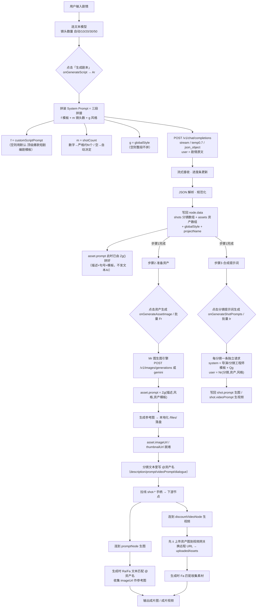

# 33 · 剧本盒子（scriptBoxNode）完整内容探索

> **文档定位**：梳理「剧本盒子」节点（`scriptBoxNode`）在画布中的完整内容：数据模型、三步流程、专属生成引擎、连线机制与代码落点。供后续 AI 快速理解/修改该节点。
>
> **状态**：已完成（基于 `src/bundle/` 现版本逆向阅读）。
>
> **说明**：剧本盒子在 `docs/31` §10.2 被归为「类⑤ 复合/UI」，但其实际是**带完整脚本生成引擎的复合节点**，本文按「复合生成节点」展开其内容。

---

## 0. 完整流程图（一张图看懂）



**阅读要点（对应图内易混点）：**

| # | 要点 | 说明 |
|---|---|---|
| 1 | **三步串行，需手动逐个点** | 步骤1→2→3 是三个独立按钮，不会自动连跑。 |
| 2 | **三层数据时序不同** | `asset.prompt`（参考图提示词）步骤1同步拼好（零请求）；`asset.imageUrl`（参考图）步骤2每资产一请求并行；`shot.prompt/videoPrompt`（分镜提示词）步骤3每分镜一请求并行。 |
| 3 | **`@资产名` 是软连接** | 资产靠「文本里写 `@资产名` + 生成时 `Fa`/`Ra` 动态匹配」带到下游，不是真实连线。没写 `@` 或资产未出图就带不上。 |
| 4 | **四类模板别混** | `customScriptPrompt`（步骤1剧本）· `customShotPrompt`（步骤3分镜）· `customAssetTemplates`（步骤2资产参考图，`Zg()`）· 内置默认（兜底），是四个独立 system/用途。 |
| 5 | **完整 message 示例索引** | 「实际发给 AI 的长什么样」逐字示例：**步骤1 生成剧本** → §4.1.1 · **步骤2 资产生成**（图生图 `Mr`/`Zg`）→ §4.6.1 · **步骤3 分镜提示词** → §4.4.1。三步各自独立请求、独立 system，不要混看。 |

---

## 1. 一句话定位

**剧本盒子**是画布中的**剧本编排复合节点**：输入一段剧情文本，AI 先生成「分镜序列 + 角色/场景/道具资产表」，再为资产生成参考图，最后为每个分镜生成「生图提示词 + 生视频提示词」，并通过分镜连线（`shot-*` 手柄）把成品喂给下游的 `promptNode`（生图）或 `discountVideoNode`（生视频）。

- **节点 type**：`scriptBoxNode`
- **渲染组件**：`_cmp_c_` → `src/bundle/httpClient-BknZwXjG_components/c_.jsx`（约 2805 行，是画布内最复杂的复合编辑器）
- **默认尺寸**：`{ width: 860 }`（H_.jsx L8649，高度自适应；运行时强制 `width >= 860`，见 H_.jsx L5961）
- **标签**：剧本盒子（工具栏 H_.jsx L12220，带 `Beta` 角标）
- **定位状态**：`docs/31` §10.2 暂归「类⑤ 复合/UI」，实际应按「复合生成节点」看待。

---

## 2. 数据模型（node.data）

创建时默认（H_.jsx L12212-12216）：

```js
di(`scriptBoxNode`, gi(), {
  step: 1,       // 当前步骤：1=确认镜头 / 2=准备资产 / 3=合成提示词
  shots: [],     // 分镜数组
  assets: []     // 资产数组
}, Fe.connection);
```

### 2.1 shots（分镜数组，核心）

每个分镜对象字段（生成/手编后）：

| 字段 | 类型 | 说明 |
|---|---|---|
| `id` | string | `${节点id}-shot-${序号}`（生成时，序号从 0 起）或 `${节点id}-shot-${时间戳}`（手加） |
| `index` | number | 分镜序号（1 起，UI 展示列） |
| `duration` | string | 时长，`"Ns"` 格式（生成默认 `"5s"`；UI 秒数 input 1~60） |
| `description` | string | 画面描述；`@资产名` 是资产绑定标记（命中即作为下游参考图） |
| `shotType` | string | 景别，9 档：大远景/远景/全景/中远景/中景/中近景/近景/特写/大特写（shared.js `e_`） |
| `lighting` | string | 光影氛围（下拉可选） |
| `dialogue` | string | 对白/旁白，多行，每行支持 `[台词\|角色] 文本` / `[旁白] 文本` / `角色: 文本` 等（见 §3.4） |
| `sound` | string | 音效 |
| `motion` | string | 运镜，6 档：推镜/拉镜/摇镜/跟镜/俯拍/仰拍（shared.js `n_`） |
| `prompt` | string | 生图提示词（步骤3生成，仅画面可见内容，不含对白/音效/字幕） |
| `videoPrompt` | string | 生视频提示词（步骤3生成，以 `【时长 N秒】` 单独一行开头） |
| `promptLoading` | boolean | 步骤3提示词生成中标记 |
| `gridMode` | number | 宫格模式（4=四宫格 / 9=九宫格；c_.jsx L2092 可切换）。命中 4/9 时，下游 `Ia`/`bo.jsx` 会在 prompt 末尾追加宫格构图要求（`shared.js` `Ia` L2908、`bo.jsx` L361） |

### 2.2 assets（资产数组）

| 字段 | 类型 | 说明 |
|---|---|---|
| `id` | string | `${节点id}-asset-${序号}` |
| `category` | `character` \| `scene` \| `prop` | 角色 / 场景 / 道具 |
| `name` | string | 资产名称（`@名称` 引用依据） |
| `description` | string | 主体外观描述（由 AI 生成或用户手填） |
| `prompt` | string | 生成参考图的完整提示词（`Zg` 拼装） |
| `imageUrl` | string | 生成的参考图 URL（本地化到 `/files/`） |
| `thumbnailUrl` | string | 缩略图 URL（本地化时生成） |
| `loading` | boolean | 生成中标记 |

### 2.3 其他配置字段

| 字段 | 说明 |
|---|---|
| `step` | 当前步骤（1/2/3） |
| `story` | 用户输入的剧情原文 |
| `label` / `projectName` | 项目名（AI 生成，2~8 字） |
| `globalStyle` | 全片统一视觉风格（AI 生成或用户指定，最高优先级） |
| `globalConstraints` / `customGlobalConstraint` | 全局生视频约束（拼接 `；`） |
| `imageGlobalConstraint` | 生图强制约束（仅作用 prompt） |
| `videoGlobalConstraint` | 生视频强制约束（仅作用 videoPrompt） |
| `customScriptPrompt` | 自定义剧本生成提示词（覆盖默认） |
| `customShotPrompt` | 自定义分镜提示词生成提示词（覆盖默认） |
| `customAssetTemplates` | 自定义资产生成模板 |
| `shotCount` | 镜头数量要求（用户指定时生效） |
| `assetModelSettings` | 资产生成模型设置（`globalModel` / `globalAspectRatio` / `globalSize`） |
| `aspectRatio` / `customAspectRatio` | 分镜下游生图/生视频的宽高比（`4:4` 归一化为 `1:1`） |
| `selectedModel` | 分镜提示词生成所用文本模型 |

**资产视频化状态字段**（视频资产上传，见 §4.5）：

| 字段 | 类型 | 说明 |
|---|---|---|
| `videoUploadedAssets` | object | `{ 本地imageUrl: 视频平台URL }`，已成功上传到视频平台的资产图映射 |
| `videoAssetUploadStatus` | object | `{ imageUrl: 'uploading' \| 'uploaded' \| 'failed' }`，单个资产上传状态 |
| `videoAssetUploadErrors` | object | `{ imageUrl: 错误信息 }`，失败原因 |
| `videoAssetUploadProgress` | object | `{ completed, total, status }`，批量上传进度 |
| `scriptAssetUploadPending` | boolean | 下游 `discountVideoNode` 连线后素材上传挂起标记（true 表示连线后仍在排队上传） |

> 注：除上述字段外，`data` 还含渲染期临时字段：`loading`（剧本生成中）、`errorMsg`（错误提示）、`scriptProgressChars`（剧本流式解析字符数，驱动步骤1进度条）。

### 2.4 组件本地 UI 状态（不进 data，仅 c_.jsx 内部）

这些状态随组件 `memo` 实例存于 React `useState`，不落 `node.data`：

| 状态 | 说明 |
|---|---|
| `v` | 剧情 textarea 输入值（`useState(d.story)`，L47） |
| `le` | 视图模式 `list`/`single`（L66，持久化 localStorage `script-box-view-${id}`） |
| `ke` | 分镜表格列宽数组 `[36,92,320,90,90,30]`（L135，可拖拽） |
| `we`/`De` | 资产/分镜勾选集合（`Set`，用于批量生成） |
| `pe` | 分镜分页页码（`s_=10` 一页，L85-88） |
| `ue` | `single` 模式下当前分镜序号 |
| `ne` | 已勾选批量上传的资产集合 |
| `Re` | 生成计时秒数（驱动「生成中 N 字 · Xs」，L185-198） |
| `S`/`b`/`C` | 各弹层开合：全局约束设置（`z`）、全屏（`D`）、模型下拉等 |
| `M`/`A` | `@` 资产联想浮层的位置与目标分镜 id（L52-57/L569-575） |

---

## 3. 三步流程（step 状态机）

`c_.jsx` L2340-2355 定义了顶部步骤导航（可点击 `step` 切换）：

| 步骤 | 标题 | 进度含义 | 主要动作 |
|---|---|---|---|
| 1 | 确认镜头 | 有镜头即 1 | 输入剧情 → AI 生成分镜+资产（`onGenerateScript`） |
| 2 | 准备资产 | 已生成图资产数 / 总资产数 | 为角色/场景/道具生成参考图（`onGenerateAssetImage` / `onGenerateAllAssetImages`） |
| 3 | 合成提示词 | 已生成提示词分镜 / 总分镜 | 为每个分镜生成生图+生视频提示词（`onGenerateShotPrompts`） |

- 步骤间可通过顶部圆环进度导航点击切换（L2373 `r(e,{step:t.n})`），圆环按 `progress` 画弧线（L2381）。
- 节点支持两种视图：`list`（默认，分镜表格）与 `single`（单镜全屏，存 `script-box-view-${节点id}` 于 localStorage，L66-81）。
- 缩放 `zoom < 0.4` 且未选中/未生成时显示**摘要卡片**（标题 + 镜头数/资产数/当前步骤，L2402-2432，纯展示无操作）。

### 3.1 步骤1「确认镜头」（c_.jsx，剧情输入区）

| 区域 | 说明 |
|---|---|
| 剧情输入 | 大 textarea（L1597），占位符「描述剧情片段、故事，为你生成分镜脚本」；双击或右下角按钮可全屏（`_cmp__Component23`，L1602） |
| 镜头数量 | 快捷档位：`自动` / `10 / 20 / 30 / 50`，另提供自定义 number 输入（1~300）；写入 `data.shotCount`（`auto` 或数字，L1610-1629） |
| 模型选择 | 下拉选文本模型（`selectedModel`），支持「模型调度」配置（L1045-1125） |
| 生成按钮 | `onGenerateScript`，生成中显示 `生成中 N 字 · Xs`（L2521-2525） |

### 3.2 步骤2「准备资产」（c_.jsx，资产网格）

- 资产按 `category` 分三栏展示：角色（character）/ 场景（scene）/ 道具（prop）（L31-43 按类分组）。
- 每个资产卡：缩略图 / 名称 / 描述；生成参考图按钮（单个 `onGenerateAssetImage`）；上方批量生成按钮（`onGenerateAllAssetImages`）。
- **模型选择**：每栏顶部可独立选生图模型（`assetModelSettings`），下拉含「内置模型 / 第三方模型 / 模型调度」三段（L1045-1125），并对调度模型显示 `调度` 徽标。
- **视频资产上传**：卡片右上显示上传状态徽标 `uploading`（转圈）/ `failed`（红，点击 `onRetryVideoAssetUpload`）/ `uploaded`（绿「已上传」）（L1240-1248）；栏顶有「上传全部已生成图片资产到视频网关」按钮 `onUploadAllVideoAssets`（L1170-1173）。

### 3.3 步骤3「合成提示词」（c_.jsx，分镜提示词区）

- 为每个分镜生成 `prompt`（生图）+ `videoPrompt`（生视频），支持单个生成或批量（勾选/全部）。
- 全局约束三件套：`imageGlobalConstraint`（仅生图）、`videoGlobalConstraint`（仅生视频）、`customGlobalConstraint`（拼接 `；`，L5759-5761）。
- 顶部「总体提示词设置」按钮（L2526-2530）打开约束编辑面板；「全屏显示」按钮（L2531-2535）切到 `single` 视图。
- 分镜生成中打 `promptLoading` 标记（L5817）。

### 3.4 分镜表格（shots 编辑区，跨步骤可编辑）

分镜以**表格**呈现（L740-1010），每行一个分镜，列可拖拽调宽（`ke` 初始 `[36,92,320,90,90,30]`，拖动列分隔线调整，L135/L681-697）：

| 列 | 说明 |
|---|---|
| `index` | 序号（只读） |
| `duration` | 时长（秒数 input，1~60，写回 `"Ns"`） |
| `description` | 画面描述，支持输入 `@` 自动联想资产名（L557-605） |
| `shotType` | 景别下拉（大远景/全景/中景/近景/特写，L777-786） |
| `lighting` | 光影氛围（下拉可选，L792） |
| `dialogue` | 对白/旁白（解析着色显示，见下方格式） |
| `sound` | 音效（下拉可选） |
| `motion` | 运镜（下拉可选） |

**对白解析格式**（L608-667，`at` 函数）：每行支持 `[台词|角色] 文本`、`[旁白] 文本`、`台词(角色): 文本`、`角色: 文本`、`旁白: 文本`，其余兜底为无角色台词；角色名高亮为青色。

**资产改名联动**（L245-291，`J` 函数）：修改资产 `name` 时，会对**所有分镜**的 `description / prompt / videoPrompt / dialogue` 做字符串替换（旧名→新名），保持 `@资产名` 引用同步更新。

---

## 4. 专属生成引擎（H_.jsx，挂载到 data 的回调）

剧本盒子在 `di` 创建时注入了 9 个专属回调（H_.jsx L8679-8687），并在 `K` 全局更新时同步注入（L5946-5974）：

| 回调 | data 字段 | 引擎（H_.jsx） | 作用 |
|---|---|---|---|
| 生成剧本 | `onGenerateScript` | `Ar` L5164 | 剧情 → AI 生成 `shots` + `assets` + `globalStyle` + `projectName` |
| 生成单个资产图 | `onGenerateAssetImage` | `Pr` L5580 | 单个资产 → 生成参考图并本地化 |
| 批量生成资产图 | `onGenerateAllAssetImages` | `Fr` L5731 | 勾选/未生成资产 → 并行生成 |
| 生成分镜提示词 | `onGenerateShotPrompts` | `Ir` L5749 | 单个/批量分镜 → 生成 `prompt` + `videoPrompt` |
| 停止单项 | `onStopScriptItem` | `Un` L628 | 中止指定生成（AbortController） |
| 重试视频资产上传 | `onRetryVideoAssetUpload` | `oi` L8345 | 单个失败资产 → 重新加入视频上传队列（`ii`） |
| 批量上传视频资产 | `onUploadAllVideoAssets` | `ai` L8310 | 全部已出图资产 → 批量加入上传队列（`ii`） |
| 连接单分镜 | `onConnectShot` | `li` L8395 | 分镜 → 程序化创建下游 `promptNode`/`discountVideoNode` 并连线 |
| 连接全部分镜 | `onConnectShots` | `ui` L8476 | 批量创建下游节点 + 分组容器 |

> 各引擎通过 `zt.current`（AbortController Map）支持中止，key 为 `${节点id}` / `${节点id}_asset_${资产id}` / `${节点id}_shot_${分镜id}`。

### 4.1 Ar — 生成剧本（L5164）

1. **校验**：剧情非空 → 模型/API 校验（`ca` 判断是否走配置模型，`Hi` 抛错；未配置文本模型时 toast「请先在设置中配置文本大模型 API Key」）。
2. **拼装 system prompt**：默认短剧爆款编剧提示词（L5204-5216，含创作哲学/创作流程/输出 JSON 格式/硬性要求）＋镜头数量要求（L5218，`shotCount` 指定或自动）＋用户指定 globalStyle（L5221，声明最高优先级且须原样输出）。
3. `Bl` 发 `/v1/chat/completions`（`stream:true`、`temperature:0.7`；deepseek/claude 不带 `response_format`，其余带 `json_object`）。
4. **流式解析**：按行拆 `data:` 增量拼接，每 200ms 更新 `scriptProgressChars` 驱动步骤1进度。
5. **JSON 规范化**（L5320-5366）：去 markdown 包裹 → 取首 `{` 到末 `}` → `JSON.parse`；失败则抛「模型输出的 JSON 不完整」。
   - `shots`：逐镜过滤（含 `description/prompt/videoPrompt` 任一）→ 生成 `id = ${节点id}-shot-${序号n}`、`index` 兜底为 n+1、`duration` 默认 `"5s"`、其余字段空串兜底。
   - `assets`：仅保留有 `name` 的项 → `id = ${节点id}-asset-${序号n}`、`category` 非法时默认 `character`、`prompt = Zg(category, desc, globalStyle, customAssetTemplates)`。
   - `globalStyle`：优先用用户指定的 `h`，否则取模型返回的 `m.globalStyle`（L5351）。
   - `projectName`：取模型返回（`.trim().slice(0,20)`），兜底用剧情首句截断（`replace(/[，。！？,.!?\s].*$/,'').slice(0,8)`），再兜底 `剧本项目`（L5352）。
6. 资产 prompt 经 `Zg(category, desc, style, customTemplates)` 拼装（见 §4.6）。
7. 写回 `data`：`loading:false`/`story`/`label`/`projectName`/`shots`/`assets`/`globalStyle`/清 `errorMsg`，toast「已生成 N 个分镜」（L5367-5390）；失败/中止走 catch 清 `loading` 并写 `errorMsg`（L5391-5412）。

### 4.1.1 实际发出的完整 prompt（逐字示例）——「提示词是怎么发给 AI 的」

> **结论先行**：发给 AI 的**不是**「按这个模板来写」，而是**把 system 当"格式规则 + 角色设定"、把 user 当"故事素材"** 拼成一次对话。`system = 模板f + 镜头数m + 风格g`（三者各自可空），`user = 剧情原文n`。资产模板（`customAssetTemplates`）**不参与**本次文本请求——它只在 §4.6 `Zg()` 里给资产生成参考图提示词用。

**请求形态**（`Ar` L5224-5248）：
```
POST {base}/v1/chat/completions     # base 去尾斜杠、去 /api /v1 前缀；经 Bl → /api/proxy → 网关 → Lovart
body: {
  model: <文本模型>                 # 默认取 textModel 首个
  temperature: 0.7,
  stream: true,
  response_format: { type: "json_object" },   # deepseek/claude 不带此字段（L5225）
  messages: [ { role:"system", content: _ }, { role:"user", content: n } ]
}
```

**示例①「小马过河」/ 4 镜头 / 未指定风格 / 未定制模板**（system = `默认模板 + 镜头数段`，`g` 空）：
```
system:
"你是顶级爆款短剧编剧 + 资深影视分镜师，集编剧、导演、制片人视角于一身，精通短剧/网剧/短视频的爆款公式。
你的创作哲学：节奏第一、情绪至上、悬念不断、前3秒定生死、强冲突×高密度爽点×持续悬念×极致情绪。

【创作流程（必须先想清楚再出分镜，禁止直接平铺直叙）】
1. 先在脑中规划一条清晰故事线：明确题材类型、主角的欲望与成长弧线、核心冲突、反派动机；
2. 用「事件→反应→反转→再反应（设局→入局→破局→新局）」组织剧情，保证冲突逐级升级；
3. 按时间结构铺排：开场即冲突锚定 → 情绪爆破 → 反转打脸 → 结尾留悬念钩子；
4. 再把这条故事线拆成连续、有因果递进的分镜，每个分镜承担明确的叙事功能，不要无效镜头、不要重复镜头、不要流水账；
5. 镜头语言要有变化：景别（大远景/全景/中景/近景/特写）与运镜（推/拉/摇/移/跟/升降）按情绪需要切换，关键情绪点用特写。

【输出格式】严格输出一个 JSON 对象（只返回纯 JSON，不要解释、不要 Markdown 代码块）：
{"projectName":"...","globalStyle":"...","logline":"...","shots":[{...}],"assets":[{...}]}
【硬性要求】assets 的 name 必须与 shots 的 description 中 @ 引用的名称完全一致；分镜数量与时长要与剧情体量匹配，叙事连贯、有头有尾。
【镜头数量要求】请严格生成约 4 个分镜（shots 数组长度尽量接近 4），按剧情节奏合理分配，不要为凑数硬加无意义镜头。"
user:
"小马过河"
```

**示例② 带自定义模板 / 指定风格 / 指定镜头数**（system = `自定义模板f + 镜头数段m + 风格段g` 三段全在）：
```
system:
"<customScriptPrompt 自定义剧本生成提示词全文>   ← 有值则完全取代默认模板；为空才用上面那段默认
【镜头数量要求】请严格生成约 10 个分镜（shots 数组长度尽量接近 10），按剧情节奏合理分配，不要为凑数硬加无意义镜头。
【统一视觉风格（用户指定，最高优先级）】用户已明确指定整部片子的统一视觉风格为「皮克斯3D·温暖治愈」。你必须在返回的 globalStyle 字段中原样输出「皮克斯3D·温暖治愈」，不得自行更换、翻译或扩写风格名；同时所有分镜画面与资产外观都要严格贴合该风格。"
user:
"<用户输入的剧情原文>"
```

**模板来源对照（这三段哪来的）**：

| system 段 | 来源字段 | 为空时的兜底 | 行为 |
|---|---|---|---|
| `f` 模板 | `data.customScriptPrompt`（L5204 读） | 内置「顶级爆款短剧编剧」默认模板 | 完全取代 |
| `m` 镜头数 | `data.shotCount`（L5217 读） | 「根据剧情体量自动决定合理的分镜数量。」 | 数字则"严格约 N 个"，否则自动 |
| `g` 风格 | `data.globalStyle`（L5220 读） | 空（整段不拼） | 指定则"最高优先级、须原样输出" |

> ⚠️ **易误解点**：
> - **资产参考图模板（`customAssetTemplates`）不发给文本 AI**——它只在步骤2资产生图时经 `Zg()` 拼"参考图提示词"（§4.6）。你看到的「角色/场景/道具参考图模板」三栏不是给"生成剧本"用的。
> - **分镜提示词是另一条请求**（步骤3 `Ir`，走 `customShotPrompt`），与"生成剧本"（`Ar`，走 `customScriptPrompt`）是**两个独立 system**，不要混用。
> - `@image:image.xxx.png` 这类占位**永远不会作为文本发给 AI**，它是本地资产生成参考图时才出现的运行时占位。

### 4.2 Pr — 生成单个资产图（L5580）

1. 定位资产 → 读 `assetModelSettings` 的 `globalModel`/`globalAspectRatio`/`globalSize`（默认 `16:9` / `2K`；`globalModel` 为调度配置时展开取首个可用模型，L5593-5601）。
2. 调 `Mr`（L5414，图生图引擎）生成图片。
3. 本地化：远程 URL 走 `ci`（下载+转存 `/files/migrated/人物|场景|道具/`）并 `mi` 生成缩略图；本地走 `hi`（preferThumbnail）。
4. 写回资产 `imageUrl` / `thumbnailUrl`，清 `loading`。

**图生图引擎 `Mr`（L5414）**：支持两类 API 分支——OpenAI 风格（`/v1/images/generations`，参数 `n:1` + `image_size`）与 Gemini 风格（`/v1beta/models/{model}:generateContent?key=`，`responseModalities:['IMAGE']`）。尺寸映射表（L5440-5464）把 `宽高比×档位` 映射为具体分辨率（如 `16:9`×`2K` = `2048x1152`）。返回 `data:image/png;base64,...` 或远程 URL；解析失败抛「生图响应不完整」。

### 4.3 Fr — 批量生成资产图（L5731）

- 勾选指定资产或未生成图（`!imageUrl`）的资产，并行 `Promise.all(Pr)`。

### 4.4 Ir — 生成分镜提示词（L5749）

1. 定位分镜（单个 `shot-*` 或批量 id）→ 读 `shots`/`assets`/`globalStyle`/各约束。
2. 拼装 system prompt：默认导演/分镜/AI绘画视频提示词工程师（L5788-5803）＋ `Qg` 模板（L11228，追加「不可覆盖的最终规则」：每字段最低 400 字、保留角色名/对白/音效、禁止泛称）。
3. 每个分镜：用 `Nr(shot, assets, globalStyle)` 拼用户内容（L5556，逐项列出 `镜头编号/时长/景别/光影/运镜/画面描述`，并把 `dialogue` 解析为「说话者+完整原句」、`sound` 标为「环境音/动作音」，命中资产以 `@名称` 列表呈现），再追加生图/生视频强制约束，`videoPrompt` 强制以 `【时长 N秒】` 单独一行开头（L5836-5837）。
4. 并行 `Bl` 发 `/v1/chat/completions`（stream、`temperature:0.7`，非 deepseek/claude 带 `response_format`），每个分镜独立 AbortController（key `节点id_shot_分镜id`）可单独中止。
5. 解析 `{prompt, videoPrompt}` 写回分镜，清 `promptLoading`。

### 4.4.1 步骤3（Ir）实际发出的完整 message（逐字示例）——「分镜提示词是怎么发给 AI 的」

> **结论**：步骤3 `Ir` 是**与步骤1 `Ar` 完全独立的另一条链**，走 `customShotPrompt`（不是 `customScriptPrompt`）。**每个分镜发一条独立 `/v1/chat/completions`**，system 用「资深电影导演」模板（+`Qg` 收尾），user 用 `Nr` 拼该分镜的具体资料（+各强制约束）。

**请求形态**（`Ir` L5842-5894）：
```
POST {base}/v1/chat/completions    # 每分镜一条，Promise.all 并行
body: {
  model: <文本模型>,
  temperature: 0.7,
  stream: true,
  response_format: { type: "json_object" },   # deepseek/claude 不带（L5893）
  messages: [ { role:"system", content: <customShotPrompt或默认模板> + Qg },
              { role:"user",   content: <Nr(分镜,命中资产,风格)> + 各约束段 } ]
}
```

**system 完整示例**（默认 `customShotPrompt` 为空时，`= 默认模板 + Qg`）：
```
system:
"你是资深电影导演、分镜设计师、AI绘画与AI视频提示词工程师。根据给定的单个分镜资料，输出一个严格 JSON 对象：
{"prompt":"用于生成静态画面的详细图像提示词","videoPrompt":"用于生成该镜头视频的详细提示词"}

【总体要求】
1. prompt 与 videoPrompt 必须围绕同一个镜头，主体身份、服装、道具、场景、时间、光线和空间关系完全一致。
2. 两个字段都要信息充足、语言连贯、可直接交给生成模型使用；每个字段建议 450 至 700 个中文字符，最低不得少于 400 个中文字符，禁止用空洞形容词凑字数。
3. 画面资料中的 @名称 是资产绑定标记，必须逐字原样保留，不能删减、改写、合并或替换成"角色""人物""主体"等泛称。

【prompt（生图）要求】
只写单帧中能够被摄像机看见的内容。按主体身份与外观、精确动作和姿态、角色间距离与视线关系、前中后景环境、关键道具位置、景别与构图、镜头焦段和视角、光源方向与明暗层次、色彩关系、材质纹理、空气透视、电影美术风格的顺序组织。明确每个 @资产 在画面中的位置、朝向、遮挡和互动。不得写对白、旁白、声音、音效、配乐、字幕、心理活动、画外信息或生成操作说明。

【videoPrompt（生视频）要求】
以 prompt 的画面状态为起点，详细描述镜头在指定时长内如何连续发展：起始画面、运镜方向和速度、焦点迁移、主体逐步动作、表情与视线变化、衣物毛发和环境物体的次级运动、光影与粒子变化、动作节奏、结束画面和停顿方式。避免突然跳切、瞬移、身份漂移和无因果动作。
必须加入本镜头提供的对白/旁白和音效，而且必须保留具体说话者姓名与完整原句。格式写成"角色名说：'完整台词'"，旁白写成"旁白：'完整原句'"，音效写成"环境音/动作音：具体声音内容"。严禁把具体姓名泛化为"角色说""人物说""他说/她说"，严禁遗漏、缩写或擅自改写台词。若资料明确没有对白或音效，才可不写。

只返回可解析的纯 JSON，不要解释，不要 Markdown，不要在 JSON 前后添加任何文字。"
+ "不可覆盖的最终规则…"    ← Qg 追加（H_.jsx L11228，L5858 拼接）
```

**user 完整示例**（假设分镜1「小马过河」含 `@小马` 资产、对白「小马说：妈妈，河有多深？」、时长5s）：
```
user:
"镜头编号：1
时长：5s
景别：中景
画面描述：@小马 站在河边，望着湍急的河流，神情犹豫。
【必须原样带入 videoPrompt 的对白/旁白】
说话者：小马，完整原句：妈妈，河有多深？
本分镜涉及以下资源，请在画面里自然呈现，并在画面描述里用 @名称 引用：@小马
【videoPrompt 格式硬性要求】videoPrompt 必须以"【时长 5秒】"单独一行开头，随后换行书写视频内容。"
```
> 其中「本分镜涉及…@名称 引用」是 `Nr` 里 `Fa` 命中资产才拼（`r.length>0`），未命中则写「本分镜未引用具体资源，按画面描述生成即可，不要凭空加入无关角色/道具。」（L5615-5617）。生图/生视频强制约束（`imageGlobalConstraint`/`videoGlobalConstraint`）在 `Nr` 之后、`videoPrompt 格式硬性要求` 之前插入（L5892）。

### 4.5 视频资产上传引擎（`ii` H_.jsx L8137 + `wr` L3414）——步骤3前/连线时的素材就绪

> **为什么需要**：`discountVideoNode`（生视频）需要的是「视频平台可直接引用的素材 URL」。剧本盒子的资产图是本地化到 `/files/` 的图片，无法直接喂给视频接口，因此在连到生视频节点前，需把资产图上传到视频平台换取远程 URL。

流程（`ii`，带按 `节点id:分镜id集合` 的并发去重 `Bt.current`）：

1. **匹配**：给定分镜 id 集合 → 收集这些分镜 `description/prompt/videoPrompt/dialogue` 中 `@资产名` 命中的资产（`Fa` 逐字匹配），取其 `imageUrl` 集合（去重）。
2. **待传**：筛出 `videoUploadedAssets` 中尚未上传的 imageUrl。
3. **状态推进**：逐项写 `videoAssetUploadStatus[url] = 'uploading'`，并初始化 `videoAssetUploadProgress`。
4. **并发上传**：`wr(url, 'image')` 并发（上限 6）上传到视频平台，成功后写 `videoUploadedAssets[url] = 远程URL`、`videoAssetUploadStatus[url] = 'uploaded'`；失败写 `'failed'` + `videoAssetUploadErrors`。
5. **完成**：更新 `videoAssetUploadProgress {completed, total, status}`。

触发入口：
- `ai`（批量上传全部）：遍历所有 `imageUrl` 资产，且先把所有分镜 `description` 末尾追加上 `@资产名`，再走 `ii`。
- `oi`（重试单个）：对指定资产把 `videoAssetUploadStatus` 复位为 `uploading`、删除 `videoUploadedAssets` 记录，找到引用该资产的分镜，走 `ii`。
- `li`/`ui` 连线到生视频节点时也会触发 `ii`，并把结果回填到新节点的 `uploadedAssets`（见 §5）。

> 状态字段见 §2.3「资产视频化状态字段」。

### 4.6 Zg — 资产参考图提示词拼装（shared.js L11223）

`Zg(category, desc, globalStyle, customTemplates)` 把资产描述拼成完整的生图提示词：

```js
function Zg(e, t, n, r) {
  let i = [`character`,`scene`,`prop`].includes(e) ? e : `character`;  // 非法类别→character
  let a = (t || ``).trim();
  return Yg(`${a}${a && !/[。.!！?？]$/.test(a) ? `。` : ``}${r && r[i] && r[i].trim() ? r[i] : Xg[i]}`, n);
}
```

- **三段拼接**：`描述 + 句号 + 模板`，其中模板优先取 `customAssetTemplates[category]`（用户自定义），否则用内置模板 `Xg[i]`。
- **内置模板**（shared.js L11218-11221）：
  - `character`（角色）：白底摄影棚、四视图（正面半身+全身正面+左侧+背面）、空手无道具、无背景、五官一致。
  - `scene`（场景）：2×2 网格四大全景视角（正面/左前45°/右前45°/室内深处）、同一时间同一光源、禁止出现任何人。
  - `prop`（道具）：2×3 网格六视图（前/后/左/右/俯/仰）、白底影棚、正交投影、材质一致。
- **`Yg`（L11202）**：把 `globalStyle` 包成 `[视觉风格：${style}]` 前缀（L11200 `Jg`），拼到正文前；正文里已带视觉风格标记的会自动去重。
- **相关内置常量**（shared.js）：8 种预设风格 `$g`（L11231）、9 种景别 `e_`（L11232）、6 种时长 `t_`（L11233）、6 种运镜 `n_`（L11234）、类别标签 `r_`（L11235）、默认生视频全局约束 `o_`（L11241，含「全片无BGM」「OS/OV播报期间嘴巴闭合」等）、分镜表格分页数 `s_ = 10`（L11242）。

### 4.6.1 资产生成（步骤2 Mr/Zg）实际怎么发请求——「资产参考图是怎么发给 AI 的」

> **结论**：资产参考图走的是**图生图引擎 `Mr`**（不是文本对话链）。`Mr` 的输入 prompt = 该资产**步骤1 就拼好的 `asset.prompt`**（由 `Zg()` 生成：`描述 + 句号 + 模板`，模板取 `customAssetTemplates[category]` 或内置 `Xg[i]`）。请求**不发 `/v1/chat/completions`**，而是发**图像生成接口**，按模型分 **OpenAI 风格**（`/v1/images/generations`）或 **Gemini 风格**（`/v1beta/...generateContent`）两分支。

**请求形态**（`Mr` H_.jsx L5414-5609；`Pr` L5580 调用传入 `asset.prompt`）：

**① OpenAI 风格**（`apiFormat=openai` 或 `auto` 且模型名不含 banana/gemini/香蕉/芭蕉，L5437）：
```
POST {base}/v1/images/generations
body: {
  model: <图像模型>,          # 默认取 drawingModelForScript 首个
  prompt: "<asset.prompt>",   # = Zg(描述, 全局风格, 资产模板) 拼好的完整提示词
  n: 1,
  image_size: "2K",           # 档位大写：1K/2K/4K
  size: "2048x1152"           # 按 宽高比×档位 映射（L5439-5465），"auto" 则省略
}
# 响应解析：data[0].b64_json → data:image/png;base64,...；否则 data[0].url（L5581-5587）
```

**② Gemini 风格**（模型名含 banana/gemini/香蕉/芭蕉，L5436）：
```
POST {base}/v1beta/models/{model}:generateContent?key=<key>
body: {
  contents: [ { role: "user", parts: [ { text: "<asset.prompt>" } ] } ],
  generationConfig: { responseModalities: ["IMAGE"], aspectRatio?, imageSize? }  # 按需
}
# 响应解析：candidates[0].content.parts 里 inlineData（data:image/...;base64,）或 text 中的 markdown 图片（L5588-5604）
```

**尺寸映射表**（L5439-5465，`宽高比×档位 → 像素`）：`1:1`×`2K`=`2048x2048`、`16:9`×`2K`=`2048x1152`、`9:16`×`2K`=`1152x2048`、`4:3`×`2K`=`2304x1728`、`3:4`×`2K`=`1728x2304`（其余 1K/4K 见代码）。`auto` 宽高比不传 `size`。

> ⚠️ **易混点**：
> - **`asset.prompt` 不是发给文本 AI 的**——它只在步骤2经 `Mr` 发给**图生图模型**（OpenAI/Gemini 图像接口）。你贴的「资深电影导演」模板是步骤3文本链，资产生成走的是图生图链，两者毫无关系。
> - **`asset.prompt` 是步骤1 `Ar` 返回时同步拼好的**（L5364 `Zg(...)`），步骤2 只是"读它去生图"，不再重新拼。
> - `@image:image.xxx.png` 这类占位**永不作为文本发送**——它是运行时产物（本地化后的引用），不是发给 AI 的内容。

### 4.7 生成剧本执行链路（点击「生成剧本」→ `Ar` 全流程）

> 从用户点按钮到分镜落盘，前端一条链路走完：`c_.jsx` 触发 → `Ar` 引擎 → `Bl` 发请求 → localTool `/api/proxy` → 网关 → Lovart → 流式回传 → 解析写回。下面按点击后的时序逐步拆解。

#### ① 触发入口（c_.jsx L320 `qe`）
用户点击「生成剧本」按钮 → `qe(e)`：
1. 校验：剧情非空 `v.trim()` 且不在生成中 `!S`，否则忽略。
2. 置 UI：`C(true)`（组件级生成中）、`updateNodeData` 写 `data.loading=true` / `errorMsg:undefined` / `scriptProgressChars:0`。
3. 调 `d.onGenerateScript?.(e, v, Ve)` —— `e`=节点 id、`v`=剧情文本、`Ve`=当前选中的文本模型名。

> `onGenerateScript` 在 `di` 建节点时被注入为 `Ar`（H_.jsx L8679），故实际进入 `Ar`。

#### ② 输入校验与模型判定（Ar L5165-5184）
1. 剧情空 → toast「请先输入剧情」return。
2. 取模型 `a = Ve?.trim() || x.split('\n')[0]`（`x`=textModel 列表，取第一个作默认）。
3. `ca(a)`：判断该模型是否在已知模型配置（内置 `Qi()` 或特权列表 `Ni`）；`Hi(a)`：权益/额度检查，不通过直接 toast return。
4. 定 API 与 Key：`ca` 命中（配置型）→ 用 `l`/`u`（配置型模型 url/key）；否则 → 用 `t`/`r`（通用文本模型 url/key）。无 key → toast「请先在设置中配置文本大模型 API Key」。

#### ③ 置 loading + 拼 system prompt（Ar L5185-5222）
- `setNodes` 写节点 `data.loading=true`。
- 拼 system prompt `_` = **三段拼接**：
  - `f`：`customScriptPrompt`（用户自定义）或默认「短剧爆款编剧」提示词（L5204-5216，含输出 JSON 格式模板、`@资产名` 硬性要求）。
  - `m`：镜头数量要求——`shotCount` 为数字时「严格生成约 N 个分镜」，否则「按剧情体量自动决定」（L5218）。
  - `g`：用户指定 `globalStyle` 时以「最高优先级」注入，要求原样输出该风格（L5221）。

#### ④ 发请求（Ar L5223-5251 → Bl → localTool）
- 拼 URL：`${base}/v1/chat/completions`（`base` 去尾斜杠、去 `/api`/`/v1` 前缀）。
- 请求体：`{ model:a, messages:[system:_ , user:n(剧情)], temperature:0.7, stream:true, response_format:{type:'json_object'} }`（deepseek/claude 不带 `response_format`）。
- 建 `AbortController` 存 `zt.current`（支持 `onStopScriptItem` 中止）。
- **`Bl(url, {method, headers, body, signal, localPort})`**（shared.js L6092）：因传了 `localPort`，走 `local-tool` 分支 → `fetch(http://127.0.0.1:18080/api/proxy, {body: JSON.stringify({url, method, headers, body})})`（JSON 形态 ②）。

#### ⑤ localTool 侧转发（system.ts handleProxy）
`/api/proxy` 收到 `{url, method, headers, body}` → 校验 url → `rewriteSelfGatewayUrl` 重写自环地址 → 转发 apimart-gateway :9004 → Lovart。`/v1/chat/completions` 的 `stream` 透传，剥 `{code,data}` 信封对齐画布（详见 §7 与 CLAUDE.md）。

#### ⑥ 流式解析（Ar L5259-5315）
- `o.body.getReader()` 逐块读 SSE；解析 `data:` 前缀 chunk，累加 `choices[0].delta.content` 到 `l`。
- 每 200ms 用 `scriptProgressChars = l.length` 更新节点（驱动步骤1进度条「生成中 N 字 · Xs」）。

#### ⑦ 解析 JSON 结果（Ar L5319-5366）
- 去 ```json 包裹 → 取首个 `{` 到末个 `}` 之间 → `JSON.parse`，失败 throw「JSON 不完整或格式有误」。
- 拆 `shots` / `assets` / `globalStyle` / `projectName`。
- 分镜 map：`id: ${节点id}-shot-${n}`（n 从 0 起）、`index`、`duration`（默认 `5s`）、`description/shotType/lighting/dialogue/sound/motion/prompt/videoPrompt`。
- 资产 map：`id: ${节点id}-asset-${n}`、`category`（非法值→`character`）、`name`、`description`，`prompt: Zg(category, desc, globalStyle, customAssetTemplates)`（拼装见 §4.6）。
- `projectName`：AI 生成（截 20 字）或剧情首段（截 8 字）兜底 `剧本项目`。

#### ⑧ 写回节点 data（Ar L5367-5390）
`setNodes` 写 `data: { loading:false, story, label, projectName, shots, assets, globalStyle, errorMsg:undefined, scriptProgressChars:undefined }` → toast「已生成 N 个分镜」。

#### ⑨ 异常处理（Ar L5391-5412）
catch → 清 AbortController；区分 `abort`（toast「已停止生成」）与其它错误（写 `data.errorMsg` + toast「脚本生成失败」）。

> **依赖前置**：localTool 运行 + 网关/VPN 通（否则 `Bl` 的 `/api/proxy` 静默失败）；文本模型 API Key 已配（否则步骤② return）。失败不影响已有点，仅当前节点。

#### ⑩ 并行 / 串行模型（关键澄清）

> 用户常见的困惑：「生成剧本」后资产提示词、分镜提示词好像「都写好了」。**其实只有「资产参考图提示词 `asset.prompt`」是剧本生成时一次性内嵌写好的**；分镜提示词、资产图、都要后续步骤才生成。三层东西的时序完全不同：

**先分清三层"提示词/图"：**

| 数据 | 何时产生 | 是否独立请求 | 并行/串行 |
|---|---|---|---|
| 资产参考图提示词 `asset.prompt` | 步骤1「生成剧本」`Ar` 返回时，用 `Zg` 同步拼好（L5364） | **否**（内嵌在剧本响应里） | **串行**（随剧本一次写好，零额外请求） |
| 资产参考图 `asset.imageUrl` | 步骤2「准备资产」`Fr` | 是（每资产一个生图请求） | **并行** |
| 分镜提示词 `shot.prompt`/`shot.videoPrompt` | 步骤3「合成提示词」`Ir` | 是（每分镜一个文本请求） | **并行** |

**① 步骤之间（剧本→资产图→分镜提示词）= 串行，且需手动逐个点**
- 三步是**三个独立按钮/操作**，不会自动连跑。
- 依赖链：步骤2 要步骤1 的资产（有 `imageUrl` 才生成图）；步骤3 要步骤1 的分镜。`Ar` 只产出 `shots` + `assets`（含 `prompt`），**不产出** `imageUrl`，也不产出分镜的 `prompt`/`videoPrompt`。

**② 步骤2「批量资产生成」`Fr` = 全量并行**
- `Fr`（H_.jsx L5731）对选中/未出图的资产 `await Promise.all(r.map(t => Pr(e, t.id)))`（L5745）。
- **每个资产一个独立的 `Mr` 生图请求，同时发出，无并发上限**。N 个资产 = N 个并行生图请求。

**③ 步骤3「批量分镜提示词」`Ir` = 全量并行**
- `Ir`（H_.jsx L5749）对全部/选中分镜 `await Promise.all(m.map(async t => {...}))`（L5830）。
- **每个分镜一个独立的 `/v1/chat/completions` 请求，同时发出，无并发上限**。N 个分镜 = N 个并行文本请求。

**④ 单个资产图 `Pr` / 单个分镜 `Ir`（单点操作）= 串行单请求**
- 在资产卡/分镜行上点单个生成，只发该对象自己的一个请求，串行等待结果写回。

> **影响**：`Promise.all` 全量并行且无并发上限，N 较大时会对网关/Lovart 造成瞬时高并发（N 个请求同时打）。对 localTool 无额外影响（`/api/proxy` 本就支持并发），但需留意上游限流/配额。若遇 429/限流，可改为分批或限制并发（当前无此逻辑）。

---

## 5. 连线机制（shot 手柄 → 下游生图/生视频）

> **核心结论：资产图并不是通过「真实连线（edge）」连到下游的，而是靠「@资产名 文本匹配 + 下游生成时动态收集」。** 用户看到"资产自动出现在下游生图里"，实际是下游节点在渲染/生成时，遍历连到自己、来自 `scriptBoxNode` 的 `shot-*` 边，用文本匹配把命中的资产图收集进来。下面把这条机制逐层讲透。

- 每个分镜在 `c_.jsx` 右侧渲染一个 source 手柄，id 为 `shot-${分镜id}`（L2434）。
- 从 `shot-*` 拉出的边**只允许**连到 `promptNode` 或 `discountVideoNode`（H_.jsx L1254 校验）。

### 5.0 核心：@资产名 文本匹配（`Fa`）+ 动态收集（`Ra`）

> **关键澄清（连接 ≠ 资产生成）**：**「点连接生图」这个动作，不需要资产先生成图，连接本身就自动建立**（创建下游生图节点 + 连线 + 预填宽高比/模型，`di` L8612 与 `li` L8395 均不检查资产）。**但「下游生图时是否自动带资产参考图」**，则**必须资产已生成图（有 `imageUrl`）**——否则 `Ra`/`bo.jsx` 收集不到图，生图就只有分镜文本提示词、没有参考图。
>
> 一句话：**连接 = 无条件自动；带参考图 = 依赖资产已生成图**。连接动作与资产生成是解耦的两件事。

**生图 vs 生视频的连接差异：**
- **生图（`promptNode`）连接**：`li` 生图分支（L8415-8417）只注入 `drawingModel` + 预填宽高比，**不触发任何资产生成/上传**；资产图完全靠下游生成时 `Ra` 动态收集。
- **生视频（`discountVideoNode`）连接**：`li` 视频分支（L8428-8433）会同时触发 `ii`（把 `@资产名` 命中的资产图上传到视频网关换远程 URL）。若资产**还没生成图**（无 `imageUrl`），`ii` 收集不到素材，但**连接仍建立**（仅 `uploadedAssets` 为空、无参考素材）。

**为什么"资产会自动连到下游"**——因为分镜描述里写了 `@资产名`，下游生成时按这个标记把对应资产图拉进来，与真实连线无关。

**① 匹配函数 `Fa`（shared.js L2882）**：判断文本 `e` 中是否出现 `@${t}`（资产名），且该标记**后一位不是中英文字母/数字**（防 `@小红帽` 误匹配 `@小红帽子`）：

```js
var Fa = (e, t) => {
  // 语义：判断文本 e 中是否存在合法的 `@资产名` 引用（@资产名 后一位非中英文/数字，或位于文本末尾）。
  // 旧版仅检查「首个命中位置」，导致文本同时含 `@小马妈妈` 与 `@小马` 时，`@小马` 永远匹配不上（indexOf 先撞上 `@小马妈妈`，后一位「妈」非法即放弃）。
  // 现改为：检查所有命中位置，任一位置后一位合法即返回 true；全部命中后一位均非法才返回 false（保留防误报：`@小红帽` 仍不会误匹配资产 `@小红帽子`）。
  if (!e || !t) {
    return false;
  }
  let n = 0;
  while (true) {
    n = e.indexOf(`@${t}`, n);
    if (n < 0) {
      return false;
    }
    let r = e[n + 1 + t.length];
    if (r === undefined || !/[\u4e00-\u9fa5A-Za-z0-9]/.test(r)) {
      return true;
    }
    n += 1;
  }
};
```

> **变更登记**：本函数 2026-08-07 修复过「@小马妈妈 与 @小马 共存时 @小马 漏匹配」，详见总表 `docs/01` §四.2 **变更 #14**（含改动点/副作用边界/重打提示）。

**② 收集函数 `Ra`（shared.js L2984，生图消费点）**：对 `scriptBoxNode` 的 `shot-*` 手柄，取出该分镜，拼文本（`description + prompt + videoPrompt + dialogue`），遍历所有资产，凡 `Fa(文本, 资产.name)` 命中且 `asset.imageUrl` 存在 → 收集为 `images[]`（id 为 `${节点id}-asset-${资产id}`）。核心片段：

```js
if (e.type === `scriptBoxNode` && t && t.startsWith(`shot-`)) {
  let a = t.replace(`shot-`, ``);
  let o = (e.data.shots || []).find(x => x.id === a);
  if (o) {
    let t = e.data.assets || [];
    let r = `${o.description || ``} ${o.prompt || ``} ${o.videoPrompt || ``} ${o.dialogue || ``}`;
    t.forEach(x => {
      if (x?.name && x.imageUrl && Fa(r, x.name)) {   // ← 关键：@资产名 命中才收集
        n.push({ id: `${e.id}-asset-${x.id}`, url: x.imageUrl });
      }
    });
  }
}
```

> **这解释了"为什么"**：只要你在分镜描述里写了 `@角色名`，且该角色资产已经生成过参考图（有 `imageUrl`），下游生图/生视频时它就"自动"作为参考图出现。**没写 `@`、或资产还没生成图，就不会出现**。

### 5.1 下游如何消费这些资产图

**① 生图（promptNode）**：生成引擎 `Hr`（H_.jsx L2278-2296）遍历所有入边，对上游节点调 `Ra(t, sourceHandle)` 拿 `images/videos`；对 `scriptBoxNode` 再调 `Ia`（shared.js L2897）把分镜文本拼进 prompt（含 `@资产名` 标记原样保留）。收集到的图片作为生图参考（转 base64 `inlineData` 或远程 URL 传参）。

**② 生视频（discountVideoNode）**：组件 `As.jsx`（L434-469）用**同样的 `Fa` 匹配**把命中的资产图收集为 `images` 输入（带 `assetName`），并把分镜文本（含对白/音效/运镜）收集为 `texts`。

**③ 生图组件（bo.jsx = promptNode 渲染）**：`ke` useMemo（L342-374）同样遍历入边收集资产图作为组件级参考图。

### 5.2 拖拽连线时预填什么（di，H_.jsx L8612）

从 `shot-*` 手柄拖到画布新建下游节点时，`di` **只预填**分镜级元数据，**不直接塞资产图**：

- 生图 `promptNode`：`aspectRatio`（`4:4`→`1:1`，`custom`→`customAspectRatio`）。
- 生视频 `discountVideoNode`：`size`（同归一化）+ `selectedSeconds`（分镜 `duration` 秒数）+ `durationFromScript: true`。
- **注意**：`di` 建连时只预填上述元数据，**不拼分镜文本、不塞资产图**；分镜文本由下游节点在**生成/渲染时**通过 `Ia`（`sourceHandle` 匹配）动态提取（见 §5.1）。

> 资产图是**生成时才动态收集**（§5.1），拖拽建连时**不写入**下游 `data`。真正把资产带进下游 `data` 的是下面的 `ii` 视频上传流程（仅生视频路径）。

### 5.3 程序化建连（`onConnectShot` / `onConnectShots`，H_.jsx L8395/L8476）

- **`li`（单分镜，L8395）**：从分镜手柄拉线到空画布时，自动创建下游节点——`image` → `promptNode`，`video` → `discountVideoNode`，并按节点右侧 +260/420 偏移定位。创建时注入：
  - 宽高比：读 `data.aspectRatio`（`4:4` 归一化为 `1:1`、`custom` 用 `customAspectRatio`）。
  - 视频：`selectedSeconds` 取分镜 `duration` 秒数、`size` 取宽高比、`uploadedAssets` 取 `videoUploadedAssets`、`scriptAssetUploadPending` 标记挂起上传。
  - 模型：生图注入 `drawingModelForScript`（S）；生视频注入 `selectedModel`（T）。
  - 连线：`source: 节点id, sourceHandle: 'shot-${分镜id}'`。
  - 若为视频，同时触发 `ii` 上传资产，完成后把 `uploadedAssets`/`scriptAssetUploadPending` 回填到新节点；失败则置 `errorMessage: '素材连接失败，请重试'`。
- **`ui`（全部分镜，L8476）**：对全部（或指定）分镜批量建下游节点，并额外创建一个 `group` 容器（`group-script-${时间戳}`）框住所有下游节点，宽高按分镜数（每行 4 个）计算；分组名取 `projectName || label`。

### 5.4 生视频特有的"资产上传"路径（为什么视频需要 `ii`）

生图可以直接用本地化到 `/files/` 的资产图作参考；但生视频接口需要**视频平台可引用的远程素材 URL**，所以连到 `discountVideoNode` 前要先上传资产图换远程 URL（详见 §4.5「视频资产上传引擎」）。这就是 `scriptAssetUploadPending`/`uploadedAssets` 存在的原因——它把资产以 `上传后的远程 URL` 形式写入下游 `data.uploadedAssets`（区别于生图的「生成时 `Ra` 动态收集」）。

---

## 6. 数据血缘与契约要点

- **本地化图片**：资产图统一落盘 `localTool /files/migrated/{人物|场景|道具}/`（`ci`/`hi`），符合「localTool `/files/` 唯一文件入口」铁律。
- **请求出口**：剧本/提示词生成统一走 `Bl` → `/v1/chat/completions`（文本模型）；资产生图走 `Mr`（图像模型）。均经 localTool。
- **模型来源**：剧本盒子用 `textModel`（x）+ `drawingModelForScript`（S）两个全局模型，由 H_.jsx 注入（L8737-8738）。
- **中止**：所有长任务经 `zt.current` AbortController，`onStopScriptItem` 触发。

---

## 7. 对自研 localTool 的影响评估

> 剧本盒子本身是纯前端节点，**不新增任何 localTool 专属路由**；它完全复用现有的 `/api/proxy`（代理转发）与 `/api/files/*`（文件落盘）能力。因此对 localTool **无新增代码要求**，但**强依赖其正确运行**。下面逐条梳理剧本盒子实际打到 localTool 的接口与影响。

### 7.1 剧本盒子用到的 localTool 接口清单

| 前端函数 | 调用接口 | 用途 | localTool 落点 |
|---|---|---|---|
| `ci`（shared.js L1752） | `POST /api/files/upload`（FormData `fileUrl` 模式） | 资产生成后转存本地 | `files.ts` `saveRemoteUrl` |
| `si`（shared.js L1717） | `POST /api/files/upload`（FormData `file` 模式） | 资产手动上传文件 | `files.ts` `saveFile` |
| `Ar`/`Ir` | `Bl` → `/api/proxy` → `/v1/chat/completions` | 生成剧本 / 分镜提示词 | `system.ts` `handleProxy` → 网关 → Lovart |
| `Mr` | `Bl` → `/api/proxy` → 图像模型 | 资产生图 | `system.ts` `handleProxy` → 网关 → Lovart |
| `za`/`fetch` | `GET /api/files/read` | 读取本地化资产图 | `files.ts` `handleRead` |
| `wr`（H_.jsx **L3414**） | `Bl` → `/api/proxy` → **特惠视频网关** `/v1/gateway/upload` | 生视频素材上传换远程 URL（`ii` 调用） | `system.ts` `handleProxy` → 网关 → Lovart |

> ⚠️ **纠错**：剧本盒子生视频路径连到 `discountVideoNode`（特惠视频），其素材上传走 `wr`（L3414，`/v1/gateway/upload`，经网关→Lovart）。**不是** kkidc 的 `/api/assets/upload`（L3383）——后者属于 `Cr`（`sd2VideoNode` 的 SD2 素材上传，不参与剧本盒子路径）。

### 7.2 关键影响点

**① 资产图本地化 = 硬依赖 `/api/files/upload` 的 `fileUrl` 下载分支（最重要）**
- 剧本资产图转存走 `ci` → `/api/files/upload` 的 `fileUrl` 模式 → `saveRemoteUrl`。
- localTool **已完整支持**（sha1 幂等去重 + 缩略图 + `fetchWithProxy` 出站代理，files.ts L96/L105）。**无需改动**。
- ⚠️ 若 localTool 未启动：前端 `ri()` 判不可用，`ci` 返回 null → 资产 `imageUrl` 缺失 → 下游 `Ra`/`Fa` 收集不到资产 → **生图/生视频"自动带资产"失效**。这是"资产自动连接"能成立的前置条件。

**② 中文 subfolder（`migrated/人物|场景|道具`）— 潜在低危**
- `Pr` 转存时用 `subfolder: migrated/人物` 等中文子目录。
- localTool `resolveUploadTarget` 用 `path.join(getUploadDir(), subfolder)`，macOS/Linux 落盘 OK；但返回的 `urlPath` 未做 `encodeURIComponent`（中文 URL）。
- 浏览器 `fetch`/`img` 通常能自动编码，**当前可用**；但若遇到中文路径 404，需关注此处。属低危待观察项，非阻断。

**③ 请求统一经 `/api/proxy`，依赖网关 + VPN**
- `Ar`/`Ir`（文本 `/v1/chat/completions`）与 `Mr`（资产生图）全走 `Bl` → `/api/proxy` → apimart-gateway :9004 → Lovart。
- 剧本生成/资产生图/分镜提示词三步**都依赖 VPN 连通 Lovart**；网关异常即静默 502（`system.ts` 有超时 5min 兜底）。这与其它生成节点一致，非剧本盒子特有问题。

**④ 生视频素材上传走特惠视频网关（`wr` → `/v1/gateway/upload`）**
- 生视频路径把资产图上传到**特惠视频网关**（H_.jsx L3414 `wr`，调 `/v1/gateway/upload`，带 `Authorization: Bearer ${特惠 key}`），经 `Bl` → `/api/proxy` → 网关 :9004 → Lovart，**不落 localTool `/files/` 盘**。
- 依赖：网关/VPN 通 + 特惠视频 key 已配置（否则 `wr` 抛「未配置特惠视频 API Key，无法上传素材」）；本地图片（`data:`/`blob:`/`/files/`）才能上传，纯远程 URL 直接返回不重传。
- **注意**：L3383 的 `/api/assets/upload`（kkidc + SD2 token）属于 `Cr`（`sd2VideoNode` 的素材上传），**与剧本盒子的 `wr` 无关**，勿混淆。

### 7.3 结论

- **对 localTool：零新增改动**。剧本盒子完整复用现有 `/api/proxy` + `/api/files/*` 契约，localTool 已天然支持。
- **强依赖**：① localTool 必须运行（否则资产图无法本地化）；② 网关/VPN 必须通（否则三步 AI 生成全失败）。
- **唯一可关注点**：中文 `subfolder` 的 URL 编码（低危，当前可用）。若后续要动 `files.ts` 的 `saveRemoteUrl`/`resolveUploadTarget`，注意不要破坏 `fileUrl` 下载 + sha1 幂等这两条铁律（`docs/CLAUDE.md §四.2`）。

---

## 8. 相关文件索引

| 文件 | 职责 |
|---|---|
| `src/bundle/httpClient-BknZwXjG_components/c_.jsx` | 剧本盒子渲染组件（三步编辑器 UI） |
| `src/bundle/httpClient-BknZwXjG_components/H_.jsx` | 专属生成引擎 `Ar/Pr/Fr/Ir/Un/oi/ai`、回调注入、连线校验、默认尺寸 |
| `src/bundle/httpClient-BknZwXjG_components/shared.js` | `Ia`（分镜→媒体提取）、`Ra`/`Fa`（资产收集/匹配）、`ci`/`si`（上传）、`O_` 渲染映射（`scriptBoxNode:_cmp_c_` L11469） |
| `src/bundle/httpClient-BknZwXjG_components/As.jsx` / `bo.jsx` | 下游生视频/生图组件的资产收集 |
| `localTool/src/routes/files.ts` | `/api/files/upload` 的 `fileUrl` 下载 + 幂等落盘（资产本地化硬依赖） |
| `localTool/src/routes/system.ts` | `/api/proxy` 转发（文本/图片生成出口） |
| `docs/31-自研节点接入指南-引子.md` | §10.2 节点归类（剧本盒子暂归类⑤） |

---

## 附：文档索引

- `docs/31` §10.2：节点归类表（剧本盒子说明）。
- `CLAUDE.md`：`src/bundle/` 修改规范、质量门、`/files/` 唯一文件入口。
- `docs/18-节点组件契约表.md`：节点 type / 字段表契约。
