# 一毛AI画布 · 数据流架构图集

> 本文档用 Mermaid 流程图全面展示系统的数据流、状态流转和架构设计。
> 所有图形均为文本描述，可在支持 Mermaid 的 Markdown 渲染器中查看。

---

## 目录

1. [系统运行时架构](#1-系统运行时架构)
2. [数据存储分层架构](#2-数据存储分层架构)
3. [资源素材完整生命周期](#3-资源素材完整生命周期)
4. [右键采集"发送到资源"流程](#4-右键采集发送到资源流程)
5. [Rescan 磁盘同步机制](#5-rescan-磁盘同步机制)
6. [AI 生成端到端流程](#6-ai-生成端到端流程)
7. [网关 AI 请求翻译流程](#7-网关-ai-请求翻译流程)
8. [任务异步轮询机制](#8-任务异步轮询机制)
9. [统一同步 Effect 流程](#9-统一同步-effect-流程)
10. [画布节点数据流](#10-画布节点数据流)
11. [文件操作服务](#11-文件操作服务)
12. [资源面板 UI 交互流](#12-资源面板-ui-交互流)
13. [配置同步与持久化](#13-配置同步与持久化)
14. [GAS 云同步流程](#14-gas-云同步流程)

---

## 1. 系统运行时架构

三个独立进程协同工作，构成完整的本地化运行环境。

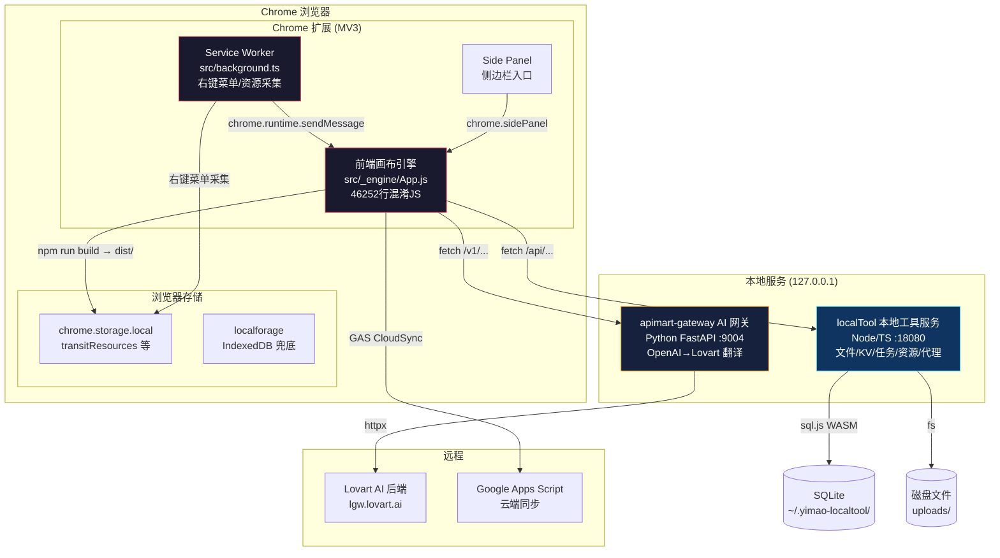

---

## 2. 数据存储分层架构

不同数据使用不同的存储策略，按优先级和持久性分层。

```mermaid
flowchart LR
    subgraph Layer1["Layer 1: 运行时内存 (最快)"]
        direction TB
        Z1[Zustand Stores<br/>canvasStore / resourceStore / taskStore<br/>uiStore / projectStore / accountStore]
        RC1[React State<br/>组件内 useState]
    end

    subgraph Layer2["Layer 2: 浏览器存储 (离线)"]
        direction TB
        CS2[chrome.storage.local<br/>transitResources<br/>右键采集素材]
        LF2[localforage (IndexedDB)<br/>canvas-state-v1-{projectId}<br/>画布节点/连线数据]
    end

    subgraph Layer3["Layer 3: localTool 持久化 (重启不丢)"]
        direction TB
        KV3[KV 表<br/>app_settings / api_configs<br/>projects / users / presetPrompts]
        TS3[Tasks 表<br/>task_id / node_id / result_url<br/>生成的完整任务记录]
        RS3[Resources 表<br/>id / url / type / folder<br/>资源索引元数据]
        DISK3[磁盘文件系统<br/>uploads/tasks/<br/>uploads/migrated/<br/>uploads/canvas/]
    end

    Z1 -->|"Q.setObject()"| KV3
    Z1 -->|"Sr.default.setItem()"| LF2
    RC1 -->|"保存画布"| LF2
    CS2 -->|"syncToLocalTool"| KV3
    DISK3 -->|"rescan → 扫描"| RS3
    KV3 -->|"wr.get()"| Z1
    LF2 -->|"Sr.default.getItem()"| RC1

    style Layer1 fill:#1a1a2e,stroke:#e94560,color:#fff
    style Layer2 fill:#0f3460,stroke:#53d8fb,color:#fff
    style Layer3 fill:#16213e,stroke:#f5a623,color:#fff
```

### 存储键对照表

```mermaid
flowchart TB
    subgraph KV["KV 存储键 (localTool KV 表)"]
        KV1[app_settings]
        KV2[api_configs]
        KV3[users]
        KV4[membership]
        KV5[projects]
        KV6[presetPrompts]
        KV7[customNodeTemplates]
        KV8[modelSchedules]
        KV9[cloud_storage_config]
        KV10[transitResources]
        KV11[transit_grid_cols]
        KV12[globalTasks]
        KV13[canvas-state-v1-{projectId}]
    end

    subgraph CS["chrome.storage.local"]
        CST[transitResources<br/>右键采集的素材<br/>最多5条]
    end

    subgraph LF["localforage (IndexedDB)"]
        LFC[canvas-state-v1-{projectId}<br/>画布节点/连线完整数据<br/>img_ / img_thumb_ / video_thumb_]
    end

    subgraph SQL["SQLite 表"]
        S1[kv 表<br/>key-value pairs]
        S2[tasks 表<br/>任务记录含结果]
        S3[resources 表<br/>资源索引]
    end

    subgraph DISK["磁盘文件"]
        D1[uploads/tasks/<br/>生成产物]
        D2[uploads/migrated/<br/>采集素材]
        D3[uploads/canvas/<br/>画布文件]
        D4[uploads/.thumbnails/<br/>缩略图缓存]
    end
```

---

## 3. 资源素材完整生命周期

从创建/采集到入库、复用、最终删除的全链路。

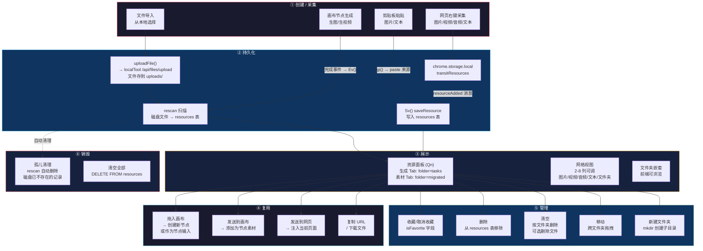

---

## 4. 右键采集"发送到资源"流程

Chrome 扩展右键菜单采集网页素材的完整数据流。

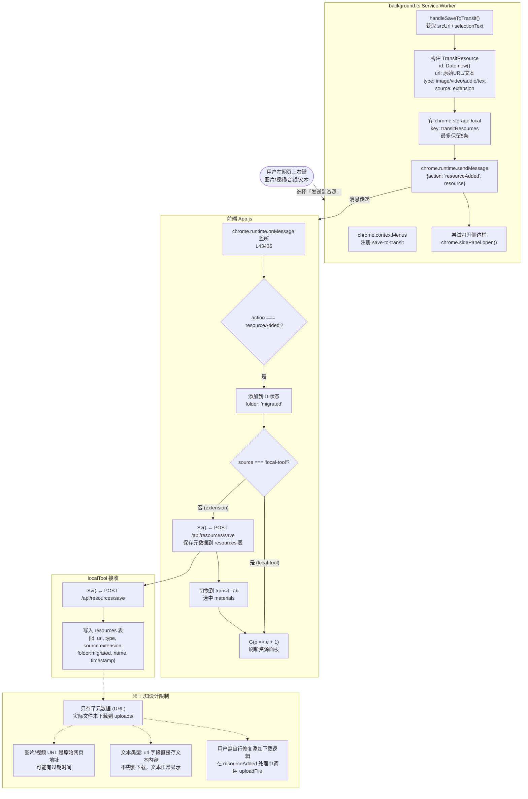

---

## 5. Rescan 磁盘同步机制

rescan 是资源系统的核心同步机制，把磁盘文件同步到 resources 表。

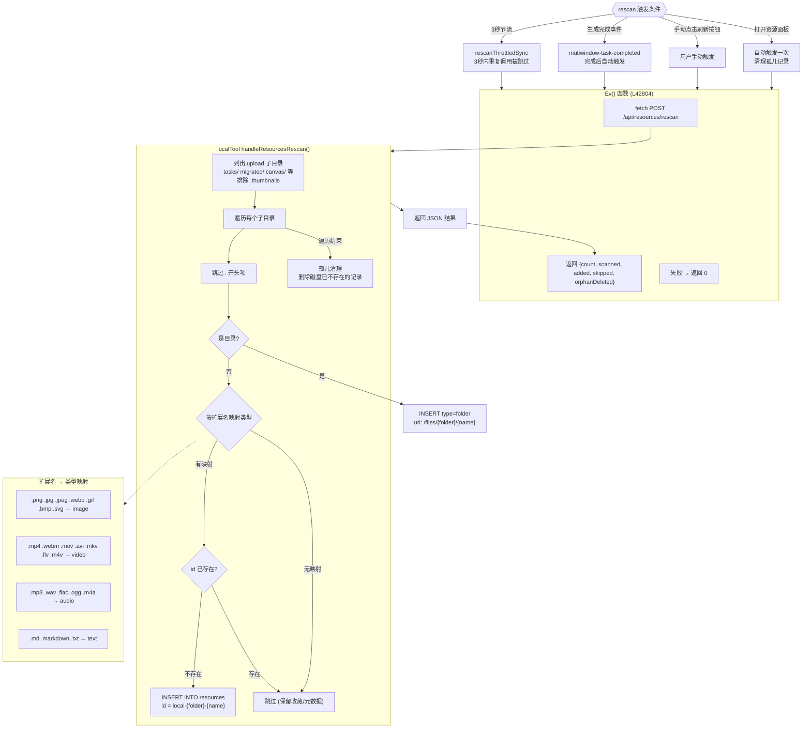

---

## 6. AI 生成端到端流程

从用户在画布上触发生成到结果展示的完整链路。

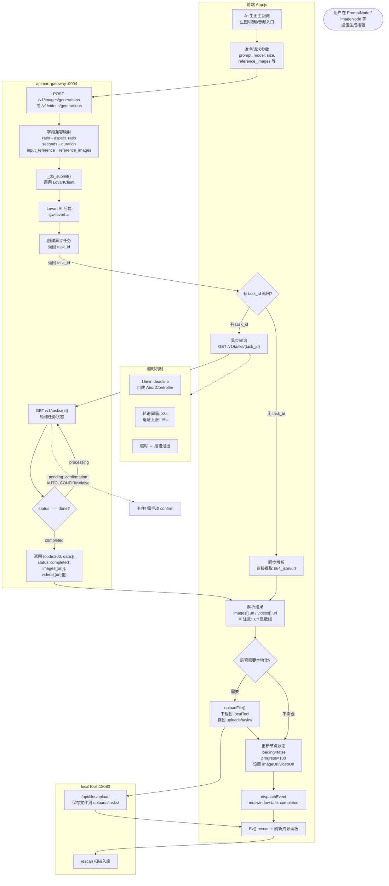

---

## 7. 网关 AI 请求翻译流程

网关把 OpenAI 风格接口翻译成 Lovart 后端调用。

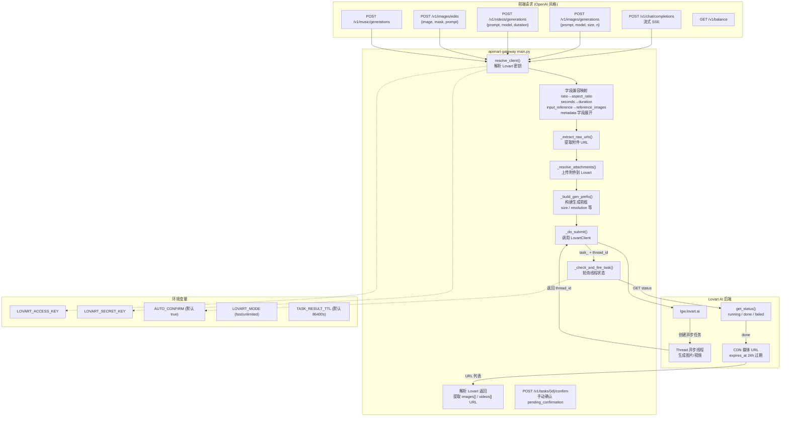

---

## 8. 任务异步轮询机制

前端轮询网关获取异步任务状态，包含 7 个必踩陷阱。


---

## 9. 统一同步 Effect 流程

修复后的"统一同步"effect，防止死循环。


---

## 10. 画布节点数据流

画布上节点之间的数据连接与状态更新。

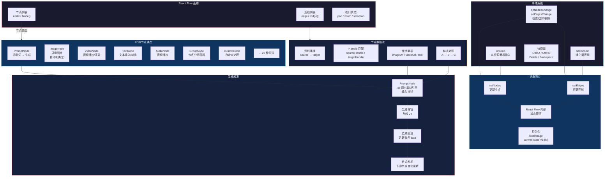

---

## 11. 文件操作服务

localTool 提供的完整文件操作 API。

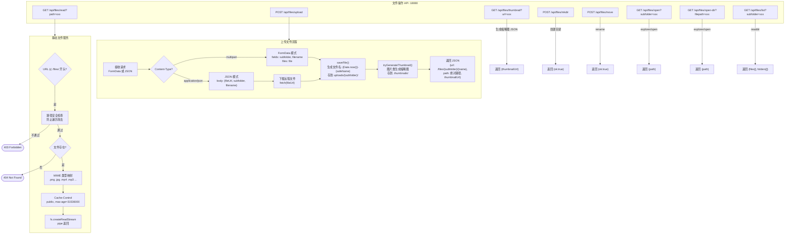

---

## 12. 资源面板 UI 交互流

资源面板（Qn 组件）中用户操作对应的数据流。

```mermaid
flowchart TB
    subgraph PANEL["资源面板 (Qn 组件)"]
        TAB["Tab 切换<br/>生成 / 素材"]
        FILTER["类型过滤<br/>全部 / 图片 / 视频 / 文本"]
        FAV_FILTER["收藏过滤<br/>只看收藏"]
        GRID["网格大小<br/>2-8 列可调"]
        FOLDER["文件夹导航<br/>后退 / 进入"]
    end

    subgraph ACTIONS["资源操作"]
        DRAG["拖入画布"]
        SEND_WEB["发送到网页"]
        SEND_CANVAS["发送到画布"]
        COPY_URL["复制 URL"]
        DOWNLOAD["下载文件"]
        SYNC_LOCAL["同步到本地引擎"]
        FAV_TOGGLE["收藏/取消收藏"]
        DELETE["删除"]
        CLEAR["清空 (按文件夹)"]
        NEW_FOLDER["新建文件夹"]
        OPEN_DIR["打开本地目录"]
        FULLSCREEN["全屏预览"]
        SEND_JIANYING["发送到剪映"]
    end

    subgraph DATA_SOURCE["数据来源"]
        LT_RESOURCES["localTool /api/resources<br/>SQLite resources 表<br/>E 状态"]
        TRANSIT["chrome.storage.local<br/>transitResources<br/>le 状态"]
        COMBINED["t = (当前 Tab 决定)<br/>生成 Tab → LT_RESOURCES<br/>素材 Tab → TRANSIT"]
    end

    subgraph EFFECTS["操作影响"]
        REFRESH["刷新列表<br/>G(e → e+1)"]
        RESCAN["Ev() rescan<br/>重新扫描磁盘"]
        API_CALL["调用 localTool API"]
        STORAGE["更新 chrome.storage"]
        TOAST["Toast 提示消息"]
    end

    TAB --> COMBINED
    FILTER -->|"f 状态"| COMBINED
    FAV_FILTER -->|"m 状态"| COMBINED
    COMBINED -->|"渲染"| GRID_VIEW["网格渲染<br/>图片/视频/音频/文本/文件夹"]

    DRAG -->|"dragStart"| DRAG_DATA["设置 dataTransfer<br/>text/plain: id<br/>application/json: resource"]
    SEND_WEB -->|"_i()"| SEND_WEB_API["chrome.scripting<br/>executeScript 注入"]
    SEND_CANVAS -->|"dispatchEvent"| CANVAS_EVENT["自定义事件<br/>Zn → 画布接收"]
    COPY_URL -->|"clipboard"| CLIPBOARD["navigator.clipboard"]
    DOWNLOAD -->|"a.click()"| DOWNLOAD_FILE["创建临时 a 标签下载"]
    SYNC_LOCAL -->|"Oi()"| RESCAN
    FAV_TOGGLE -->|"mi()"| API_CALL
    FAV_TOGGLE --> REFRESH
    DELETE -->|"wv()"| API_CALL
    DELETE --> REFRESH
    CLEAR -->|"hi()"| CLEAR_API["POST /api/resources/clear<br/>deleteFiles: true"]
    CLEAR --> REFRESH
    NEW_FOLDER -->|"mkdir"| API_CALL
    NEW_FOLDER --> REFRESH
    OPEN_DIR -->|"explorer"| SHELL_CMD["execSync explorer"]
    FULLSCREEN -->|"setFullscreenResource"| FULLSCREEN_VIEW["全屏遮罩层<br/>图片/视频预览"]
    SEND_JIANYING -->|"Yn()"| JIANYING_API["/api/jianying/send"]
```

---

## 13. 配置同步与持久化

配置项的保存、加载、同步链。

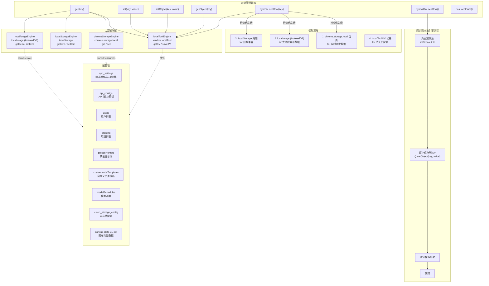

---

## 14. GAS 云同步流程

通过 Google Apps Script 实现的云端同步机制。

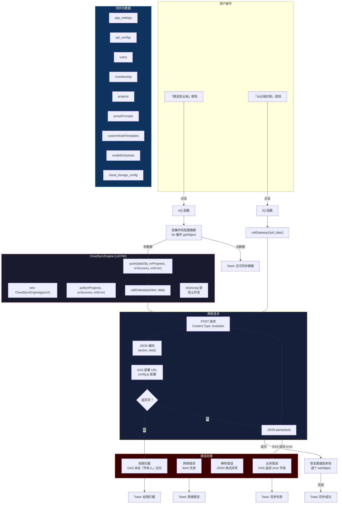

---

## 附录：关键代码位置速查

| 功能 | 文件 | 行号 |
|------|------|------|
| 资源面板组件 Qn | App.js | L169 |
| Rescan 函数 Ev() | App.js | L42804 |
| 同步到本地 Oi() | App.js | L44322 |
| 统一同步 effect | App.js | L44246 |
| 资源数据加载 xv() | App.js | L42742 |
| 资源保存 Sv() | App.js | L42759 |
| 右键采集消息处理 | App.js | L43436 |
| 生图主回调 Jn | App.js | ~L32731 |
| 生图任务轮询 | App.js | L32910 |
| 存储键 Z | App.js | L1260 |
| 本地存储引擎 wr | App.js | L1297 |
| Chrome 存储引擎 Mr | App.js | L1364 |
| GAS 云同步引擎 | App.js | L43760 |
| localTool 入口 | localTool/src/index.ts | L1 |
| 文件操作路由 | localTool/src/routes/files.ts | L1 |
| 资源路由 | localTool/src/routes/resources.ts | L1 |
| 任务路由 | localTool/src/routes/tasks.ts | L1 |
| 数据库初始化 | localTool/src/db/database.ts | L1 |
| 网关入口 | apimart-gateway/main.py | L1 |
| 字段兼容映射 | apimart-gateway/main.py | L687 |
| 任务轮询 | apimart-gateway/main.py | L783 |
| 配置层 | src/_engine/config.js | L1 |
| Service Worker | src/background.ts | L1 |
| 扩展入口 | src/main.tsx | L1 |