# 一毛AI画布 · 数据流架构图集

> 本文档用 Mermaid 流程图全面展示系统的数据流、状态流转和架构设计。
> 所有图形均为文本描述，可在支持 Mermaid 的 Markdown 渲染器中查看。

---

## 目录

1. [系统运行时架构](#1-系统运行时架构)
2. [数据存储分层架构](#2-数据存储分层架构)
3. [资源素材完整生命周期](#3-资源素材完整生命周期)
4. [右键采集"发送到资源"流程](#4-右键采集发送到资源流程)
5. [Rescan 磁盘同步机制](#5-rescan-磁盘同步机制)
6. [AI 生成端到端流程](#6-ai-生成端到端流程)
7. [网关 AI 请求翻译流程](#7-网关-ai-请求翻译流程)
8. [任务异步轮询机制](#8-任务异步轮询机制)
9. [统一同步 Effect 流程](#9-统一同步-effect-流程)
10. [画布节点数据流](#10-画布节点数据流)
11. [文件操作服务](#11-文件操作服务)
12. [资源面板 UI 交互流](#12-资源面板-ui-交互流)
13. [配置同步与持久化](#13-配置同步与持久化)
14. [GAS 云同步流程](#14-gas-云同步流程)

---

## 1. 系统运行时架构

三个独立进程协同工作，构成完整的本地化运行环境。

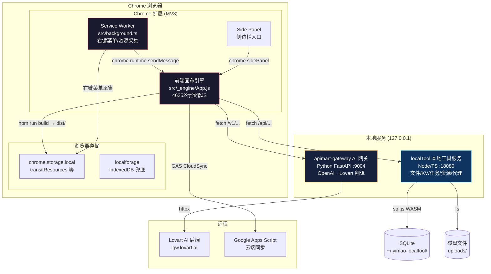

---

## 2. 数据存储分层架构

不同数据使用不同的存储策略，按优先级和持久性分层。

```mermaid
flowchart LR
    subgraph Layer1["Layer 1: 运行时内存 (最快)"]
        direction TB
        Z1[Zustand Stores<br/>canvasStore / resourceStore / taskStore<br/>uiStore / projectStore / accountStore]
        RC1[React State<br/>组件内 useState]
    end

    subgraph Layer2["Layer 2: 浏览器存储 (离线)"]
        direction TB
        CS2[chrome.storage.local<br/>transitResources<br/>右键采集素材]
        LF2[localforage (IndexedDB)<br/>canvas-state-v1-{projectId}<br/>画布节点/连线数据]
    end

    subgraph Layer3["Layer 3: localTool 持久化 (重启不丢)"]
        direction TB
        KV3[KV 表<br/>app_settings / api_configs<br/>projects / users / presetPrompts]
        TS3[Tasks 表<br/>task_id / node_id / result_url<br/>生成的完整任务记录]
        RS3[Resources 表<br/>id / url / type / folder<br/>资源索引元数据]
        DISK3[磁盘文件系统<br/>uploads/tasks/<br/>uploads/migrated/<br/>uploads/canvas/]
    end

    Z1 -->|"Q.setObject()"| KV3
    Z1 -->|"Sr.default.setItem()"| LF2
    RC1 -->|"保存画布"| LF2
    CS2 -->|"syncToLocalTool"| KV3
    DISK3 -->|"rescan → 扫描"| RS3
    KV3 -->|"wr.get()"| Z1
    LF2 -->|"Sr.default.getItem()"| RC1

    style Layer1 fill:#1a1a2e,stroke:#e94560,color:#fff
    style Layer2 fill:#0f3460,stroke:#53d8fb,color:#fff
    style Layer3 fill:#16213e,stroke:#f5a623,color:#fff
```

### 存储键对照表

```mermaid
flowchart TB
    subgraph KV["KV 存储键 (localTool KV 表)"]
        KV1[app_settings]
        KV2[api_configs]
        KV3[users]
        KV4[membership]
        KV5[projects]
        KV6[presetPrompts]
        KV7[customNodeTemplates]
        KV8[modelSchedules]
        KV9[cloud_storage_config]
        KV10[transitResources]
        KV11[transit_grid_cols]
        KV12[globalTasks]
        KV13[canvas-state-v1-{projectId}]
    end

    subgraph CS["chrome.storage.local"]
        CST[transitResources<br/>右键采集的素材<br/>最多5条]
    end

    subgraph LF["localforage (IndexedDB)"]
        LFC[canvas-state-v1-{projectId}<br/>画布节点/连线完整数据<br/>img_ / img_thumb_ / video_thumb_]
    end

    subgraph SQL["SQLite 表"]
        S1[kv 表<br/>key-value pairs]
        S2[tasks 表<br/>任务记录含结果]
        S3[resources 表<br/>资源索引]
    end

    subgraph DISK["磁盘文件"]
        D1[uploads/tasks/<br/>生成产物]
        D2[uploads/migrated/<br/>采集素材]
        D3[uploads/canvas/<br/>画布文件]
        D4[uploads/.thumbnails/<br/>缩略图缓存]
    end
```

---

## 3. 资源素材完整生命周期

从创建/采集到入库、复用、最终删除的全链路。

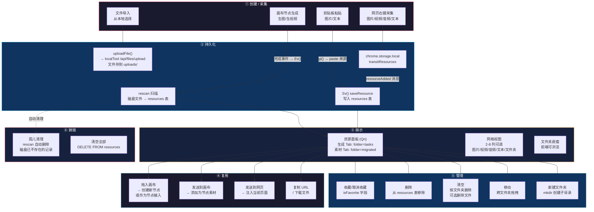

---

## 4. 右键采集"发送到资源"流程

Chrome 扩展右键菜单采集网页素材的完整数据流。


---

## 5. Rescan 磁盘同步机制

rescan 是资源系统的核心同步机制，把磁盘文件同步到 resources 表。

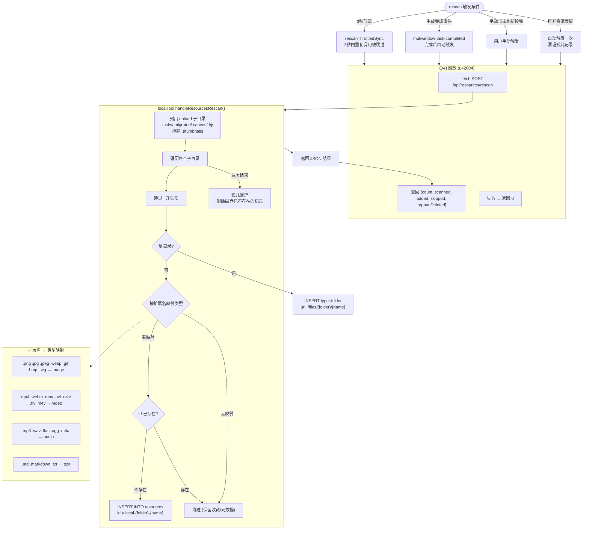

---

## 6. AI 生成端到端流程

从用户在画布上触发生成到结果展示的完整链路。


---

## 7. 网关 AI 请求翻译流程

网关把 OpenAI 风格接口翻译成 Lovart 后端调用。

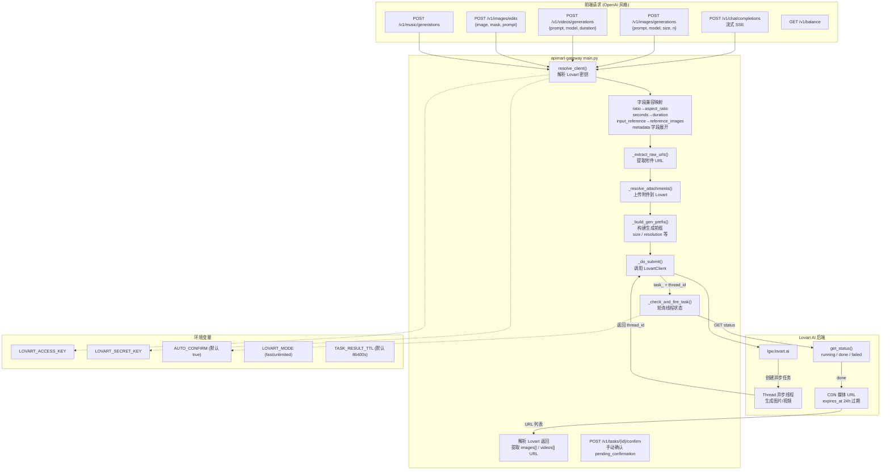

---

## 8. 任务异步轮询机制

前端轮询网关获取异步任务状态，包含 7 个必踩陷阱。

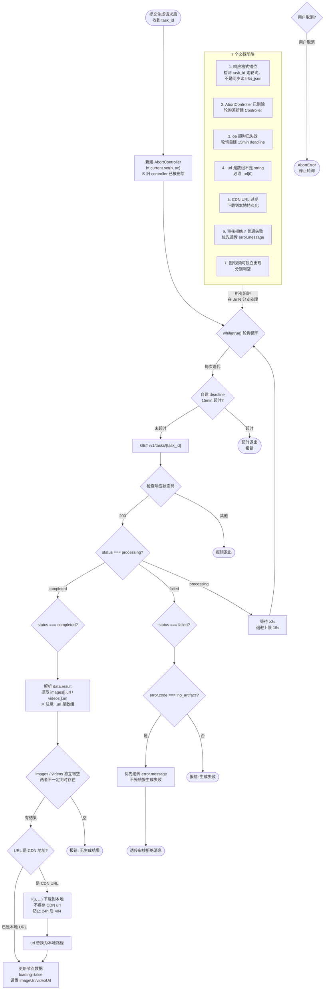

---

## 9. 统一同步 Effect 流程

修复后的"统一同步"effect，防止死循环。

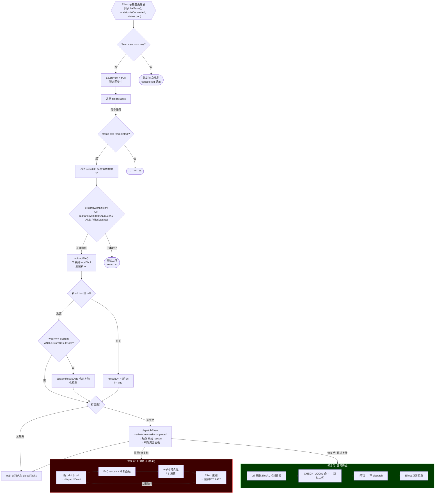

---

## 10. 画布节点数据流

画布上节点之间的数据连接与状态更新。

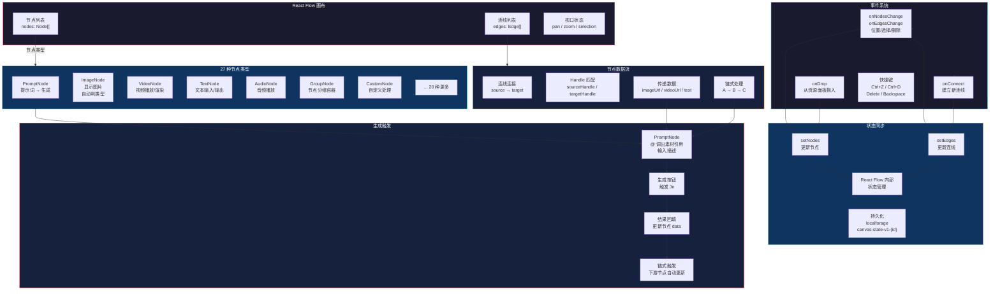

---

## 11. 文件操作服务

localTool 提供的完整文件操作 API。


---

## 12. 资源面板 UI 交互流

资源面板（Qn 组件）中用户操作对应的数据流。

```mermaid
flowchart TB
    subgraph PANEL["资源面板 (Qn 组件)"]
        TAB["Tab 切换<br/>生成 / 素材"]
        FILTER["类型过滤<br/>全部 / 图片 / 视频 / 文本"]
        FAV_FILTER["收藏过滤<br/>只看收藏"]
        GRID["网格大小<br/>2-8 列可调"]
        FOLDER["文件夹导航<br/>后退 / 进入"]
    end

    subgraph ACTIONS["资源操作"]
        DRAG["拖入画布"]
        SEND_WEB["发送到网页"]
        SEND_CANVAS["发送到画布"]
        COPY_URL["复制 URL"]
        DOWNLOAD["下载文件"]
        SYNC_LOCAL["同步到本地引擎"]
        FAV_TOGGLE["收藏/取消收藏"]
        DELETE["删除"]
        CLEAR["清空 (按文件夹)"]
        NEW_FOLDER["新建文件夹"]
        OPEN_DIR["打开本地目录"]
        FULLSCREEN["全屏预览"]
        SEND_JIANYING["发送到剪映"]
    end

    subgraph DATA_SOURCE["数据来源"]
        LT_RESOURCES["localTool /api/resources<br/>SQLite resources 表<br/>E 状态"]
        TRANSIT["chrome.storage.local<br/>transitResources<br/>le 状态"]
        COMBINED["t = (当前 Tab 决定)<br/>生成 Tab → LT_RESOURCES<br/>素材 Tab → TRANSIT"]
    end

    subgraph EFFECTS["操作影响"]
        REFRESH["刷新列表<br/>G(e → e+1)"]
        RESCAN["Ev() rescan<br/>重新扫描磁盘"]
        API_CALL["调用 localTool API"]
        STORAGE["更新 chrome.storage"]
        TOAST["Toast 提示消息"]
    end

    TAB --> COMBINED
    FILTER -->|"f 状态"| COMBINED
    FAV_FILTER -->|"m 状态"| COMBINED
    COMBINED -->|"渲染"| GRID_VIEW["网格渲染<br/>图片/视频/音频/文本/文件夹"]

    DRAG -->|"dragStart"| DRAG_DATA["设置 dataTransfer<br/>text/plain: id<br/>application/json: resource"]
    SEND_WEB -->|"_i()"| SEND_WEB_API["chrome.scripting<br/>executeScript 注入"]
    SEND_CANVAS -->|"dispatchEvent"| CANVAS_EVENT["自定义事件<br/>Zn → 画布接收"]
    COPY_URL -->|"clipboard"| CLIPBOARD["navigator.clipboard"]
    DOWNLOAD -->|"a.click()"| DOWNLOAD_FILE["创建临时 a 标签下载"]
    SYNC_LOCAL -->|"Oi()"| RESCAN
    FAV_TOGGLE -->|"mi()"| API_CALL
    FAV_TOGGLE --> REFRESH
    DELETE -->|"wv()"| API_CALL
    DELETE --> REFRESH
    CLEAR -->|"hi()"| CLEAR_API["POST /api/resources/clear<br/>deleteFiles: true"]
    CLEAR --> REFRESH
    NEW_FOLDER -->|"mkdir"| API_CALL
    NEW_FOLDER --> REFRESH
    OPEN_DIR -->|"explorer"| SHELL_CMD["execSync explorer"]
    FULLSCREEN -->|"setFullscreenResource"| FULLSCREEN_VIEW["全屏遮罩层<br/>图片/视频预览"]
    SEND_JIANYING -->|"Yn()"| JIANYING_API["/api/jianying/send"]
```

---

## 13. 配置同步与持久化

配置项的保存、加载、同步链。

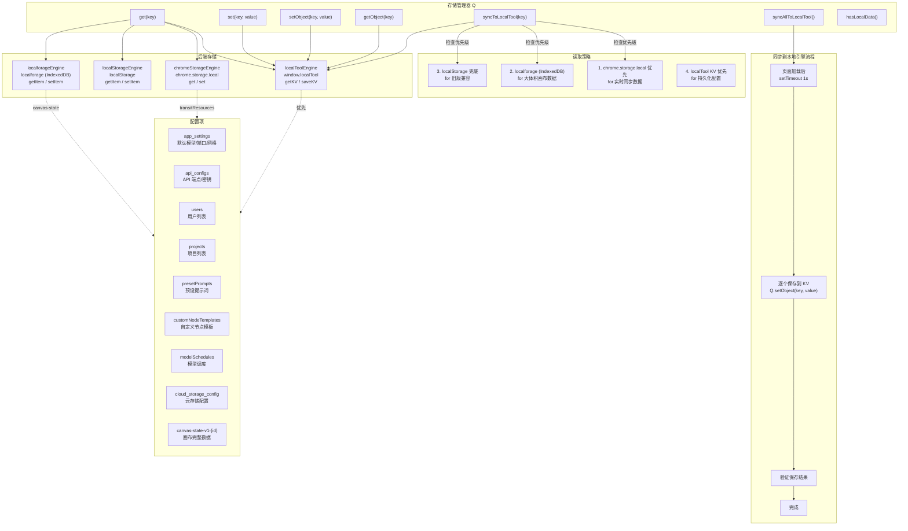

---

## 14. GAS 云同步流程

通过 Google Apps Script 实现的云端同步机制。

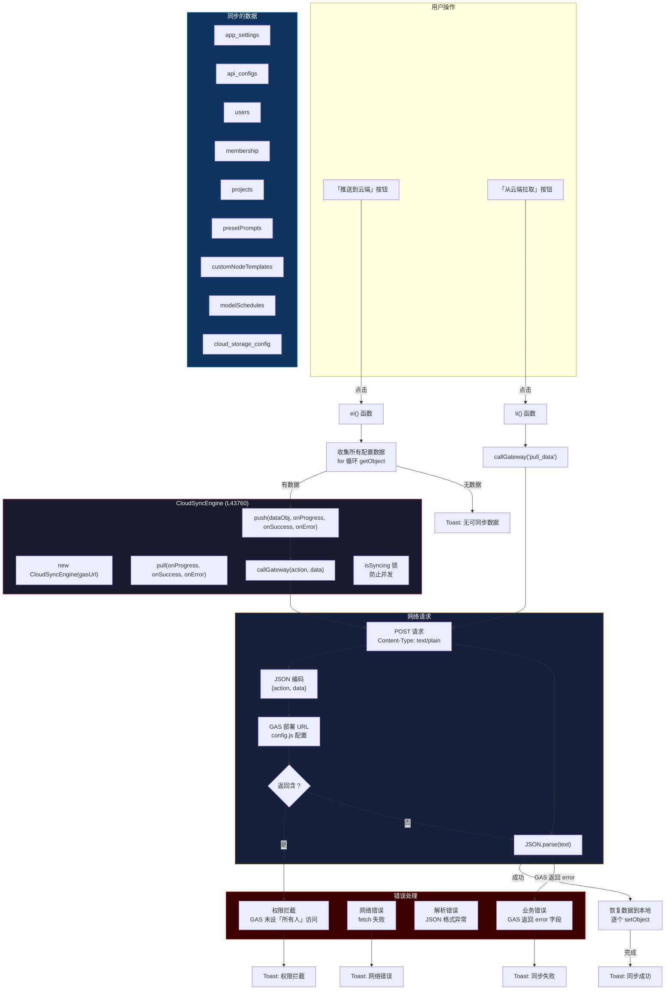

---

## 附录：关键代码位置速查

| 功能 | 文件 | 行号 |
|------|------|------|
| 资源面板组件 Qn | App.js | L169 |
| Rescan 函数 Ev() | App.js | L42804 |
| 同步到本地 Oi() | App.js | L44322 |
| 统一同步 effect | App.js | L44246 |
| 资源数据加载 xv() | App.js | L42742 |
| 资源保存 Sv() | App.js | L42759 |
| 右键采集消息处理 | App.js | L43436 |
| 生图主回调 Jn | App.js | ~L32731 |
| 生图任务轮询 | App.js | L32910 |
| 存储键 Z | App.js | L1260 |
| 本地存储引擎 wr | App.js | L1297 |
| Chrome 存储引擎 Mr | App.js | L1364 |
| GAS 云同步引擎 | App.js | L43760 |
| localTool 入口 | localTool/src/index.ts | L1 |
| 文件操作路由 | localTool/src/routes/files.ts | L1 |
| 资源路由 | localTool/src/routes/resources.ts | L1 |
| 任务路由 | localTool/src/routes/tasks.ts | L1 |
| 数据库初始化 | localTool/src/db/database.ts | L1 |
| 网关入口 | apimart-gateway/main.py | L1 |
| 字段兼容映射 | apimart-gateway/main.py | L687 |
| 任务轮询 | apimart-gateway/main.py | L783 |
| 配置层 | src/_engine/config.js | L1 |
| Service Worker | src/background.ts | L1 |
| 扩展入口 | src/main.tsx | L1 |
| 画布节点渲染 | App.js | ~L37050 |
| 画布 onDrop | App.js | L36215 |
| 画布 onDragOver | App.js | L36212 |
| 图片编辑 (inpaint/outpaint) | App.js | ~L32731 |
| 用户余额/积分检查 | App.js | L15323 |
| 错误消息分类 | App.js | L31127 |
| 剪映发送 route | localTool/src/routes/system.ts | L159 |
| 网关编辑路由 | apimart-gateway/main.py | L595 |
| 网关音乐路由 (501) | apimart-gateway/main.py | L655 |
| 网关余额查询 | apimart-gateway/main.py | L922 |
| 数据库 initTables | localTool/src/db/database.ts | L59 |
| 应用入口 | src/main.tsx | L1 |
| AppShell 外壳 | src/v2/AppShell.tsx | L1 |
| canvasStore | src/v2/stores/canvasStore.ts | L1 |
| resourceStore | src/v2/stores/resourceStore.ts | L1 |
| taskStore | src/v2/stores/taskStore.ts | L1 |
| uiStore | src/v2/stores/uiStore.ts | L1 |
| projectStore | src/v2/stores/projectStore.ts | L1 |
| accountStore | src/v2/stores/accountStore.ts | L1 |

---

## 15. 画布拖放交互流（交叉点）

从资源面板/任务清单/外部文件拖入画布的数据流，这是**资源→画布**的核心交叉点。

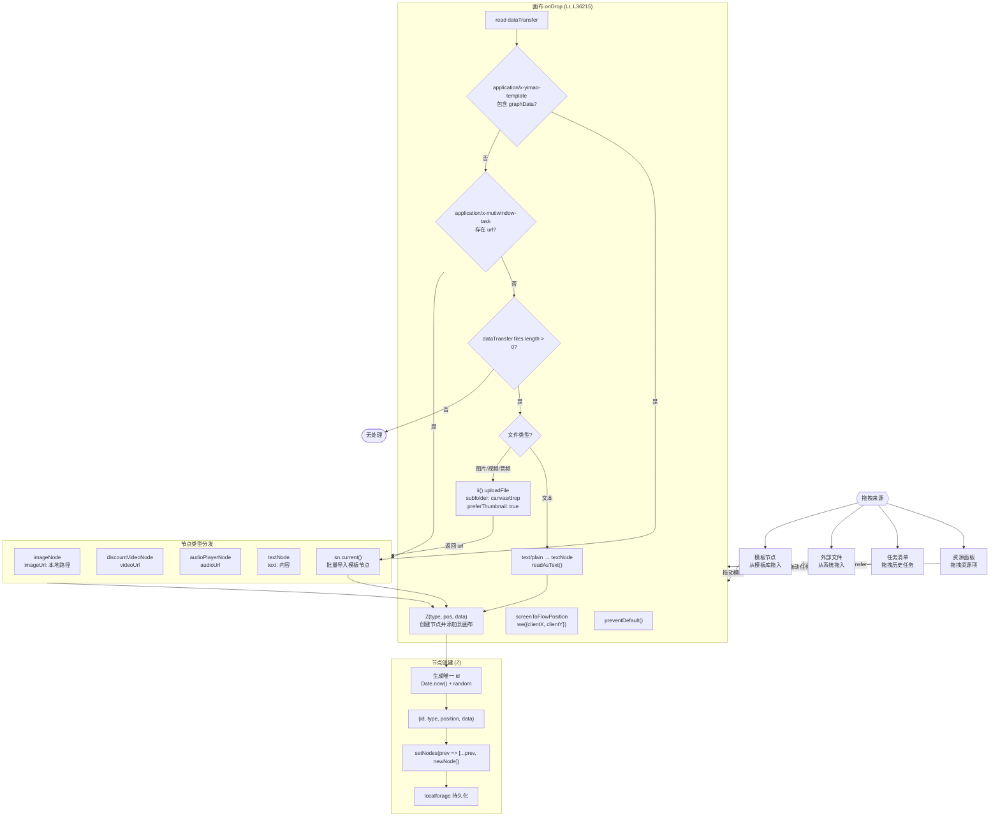

---

## 16. 启动初始化流程（交叉点）

页面加载时涉及**存储引擎→配置同步→状态恢复→画布渲染**的完整启动链。

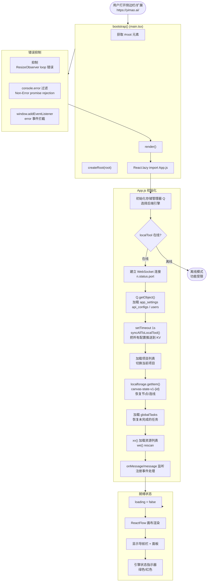

---

## 17. 前端 Zustand 状态管理关系

V2 前端六个 store 之间的关系和依赖链。

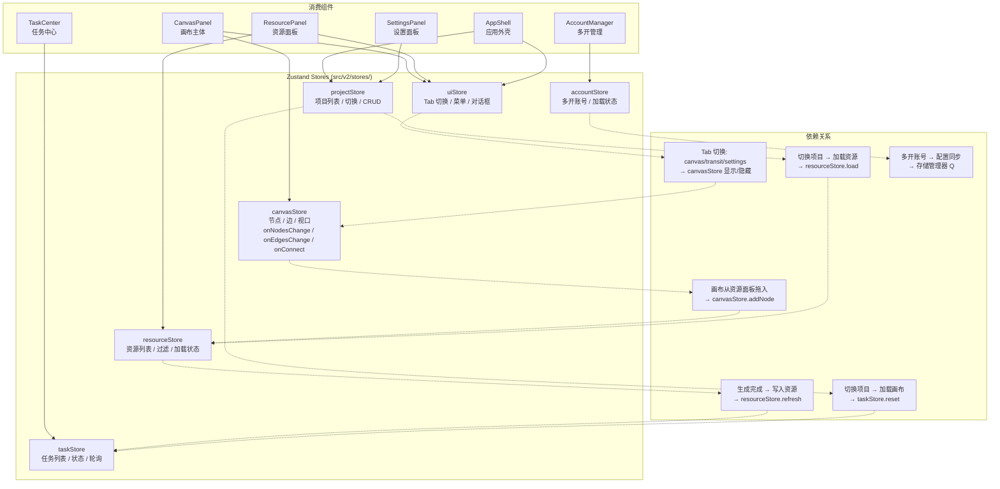

---

## 18. 图片编辑流程 (Inpaint/Outpaint)

与普通 AI 生成不同的特殊流程——需要上传额外图片数据。

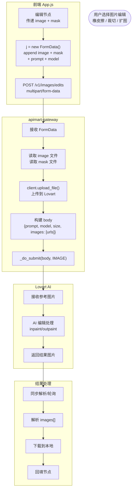

---

## 19. 用户余额/积分检查流程

AI 生成前的配额检查，以及错误响应中的余额处理。

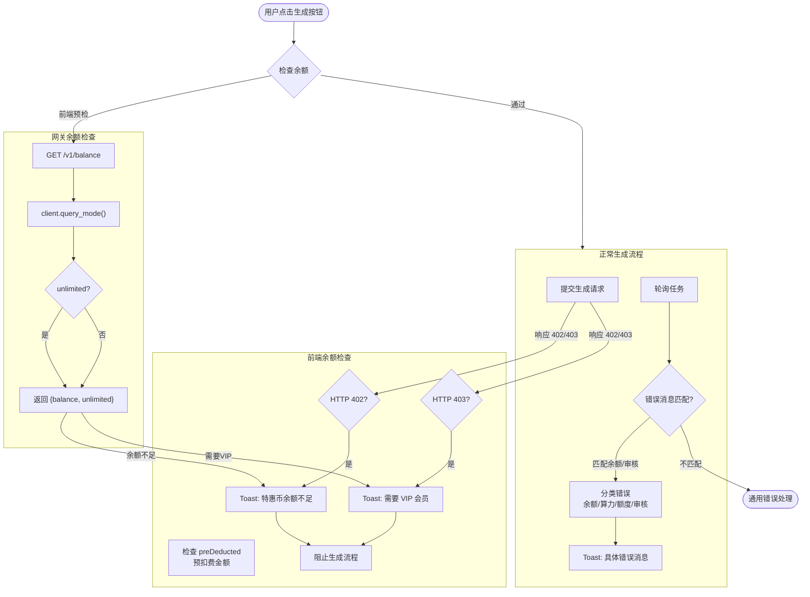

---

## 20. 错误处理与分级回退

系统中各层级的错误处理机制和回退策略。

```mermaid
flowchart TB
    subgraph LAYER1["L1: React 错误边界"]
        EB[ErrorBoundary 组件<br/>src/v2/components/ErrorBoundary.tsx]
        CATCH["catch(error, errorInfo)"]
        SHOW_FALLBACK["显示降级 UI<br/>错误信息 + 重试按钮"]
        RECOVER["点击重试 → remount"]
    end

    subgraph LAYER2["L2: fetch/网络错误"]
        FETCH_ERR["fetch 调用失败"]
        RETRY{"重试策略?"}
        RETRY_3["重试 3 次<br/>每次间隔递增"]
        TIMEOUT["15min deadline 超时"]
        ABORT["AbortController 取消"]
        FALLBACK["回退到备用方案<br/>如 base64 兜底"]
    end

    subgraph LAYER3["L3: 业务逻辑错误"]
        ERR_402["HTTP 402 余额不足"]
        ERR_403["HTTP 403 权限不足"]
        ERR_404["网关 404<br/>＝ 无害噪音"]
        ERR_500["网关 500 服务器错误"]
        WS_ERR["WebSocket 断连"]
        LOCAL_ERR["localTool 离线"]
    end

    subgraph LAYER4["L4: 控制台噪音抑制"]
        RESIZE["ResizeObserver loop<br/>→ silent ignore"]
        ROOT_ERR["RootErrorBoundary<br/>useState null → 无害噪音"]
        PORT_ERR["18080 连不上<br/>→ 状态指示器变红"]
        PROMISE["Non-Error promise rejection<br/>→ silent ignore"]
    end

    subgraph RECOVERY["恢复策略"]
        AUTO_RECONNECT["WebSocket 自动重连"]
        RELOAD["手动刷新页面"]
        RETRY_GEN["重新生成"]
        SWITCH_ENGINE["切换引擎<br/>localTool ↔ 远程"]
        CONSOLE_WARN["console.warn 记录"]
        TOAST["Toast 提示用户"]
    end

    LAYER1 --> CATCH
    CATCH --> SHOW_FALLBACK
    SHOW_FALLBACK --> RECOVER

    LAYER2 --> FETCH_ERR
    FETCH_ERR --> RETRY
    RETRY -->|"超时"| TIMEOUT
    RETRY -->|"取消"| ABORT
    TIMEOUT --> TOAST
    ABORT --> TOAST

    LAYER3 --> ERR_402
    LAYER3 --> ERR_403
    LAYER3 --> ERR_404
    LAYER3 --> ERR_500
    LAYER3 --> WS_ERR
    LAYER3 --> LOCAL_ERR
    ERR_402 --> TOAST
    ERR_403 --> TOAST
    ERR_404 --> CONSOLE_WARN
    ERR_500 --> RETRY
    WS_ERR --> AUTO_RECONNECT
    LOCAL_ERR --> STATUS_IND["状态指示器变红"]

    LAYER4 --> RESIZE
    LAYER4 --> ROOT_ERR
    LAYER4 --> PORT_ERR
    LAYER4 --> PROMISE
    RESIZE -->|"silent"| SKIP(["跳过"])
    ROOT_ERR -->|"silent"| SKIP
    PORT_ERR --> STATUS_IND
    PROMISE -->|"silent"| SKIP
```

---

## 21. 剪映素材发送流程（交叉点）

资源面板 → 剪映的跨应用数据流。

```mermaid
flowchart TB
    USER_SEND([用户在资源面板<br/>选择「发送到剪映」])

    subgraph FRONT["前端 App.js"]
        YN["Yn 组件<br/>显示发送按钮"]
        SELECT["选择资源项<br/>勾选或单资源"]
        CLICK_SEND["点击发送"]
        BUILD_REQ["构建请求体<br/>{fileUrl, localPath, fileName}<br/>或 {items: [...]}"]
        POST_JY["POST /api/jianying/send"]
    end

    subgraph LOCAL["localTool"]
        RECV_JY["handleJianyingSend()"]
        PARSE_BODY["解析 JSON body"]
        CHECK_FORM{"items 数组?"}
        BATCH_MODE["批量模式<br/>遍历 items 逐个处理"]
        SINGLE_MODE["单文件模式<br/>{fileUrl, localPath, fileName}"]
        LOG_SEND["console.log 记录日志"]
        RETURN_OK["返回 {status: 'ok', count, message}"]
    end

    USER_SEND --> YN
    YN --> SELECT
    SELECT --> CLICK_SEND
    CLICK_SEND --> BUILD_REQ
    BUILD_REQ --> POST_JY
    POST_JY --> RECV_JY
    RECV_JY --> PARSE_BODY
    PARSE_BODY --> CHECK_FORM
    CHECK_FORM -->|"是"| BATCH_MODE
    CHECK_FORM -->|"否"| SINGLE_MODE
    BATCH_MODE --> LOG_SEND
    SINGLE_MODE --> LOG_SEND
    LOG_SEND --> RETURN_OK

    subgraph LIMITATION["当前限制"]
        NOTE1["剪映集成是占位实现<br/>实际需要剪映插件 API"]
        NOTE2["仅记录日志，不真正发送"]
        NOTE3["剪映草稿目录对接<br/>需后续实现"]
    end

    RETURN_OK -.-> NOTE1
    NOTE1 -.-> NOTE2
    NOTE1 -.-> NOTE3
```

---

## 22. 文件拖拽/粘贴/导入全流程

外部文件进入系统的所有入口，以及各自的数据流路径。

```mermaid
flowchart TB
    ENTRY{{"文件进入方式"}}

    ENTRY --> RIGHT_CLICK["右键「发送到资源」<br/>→ chrome.storage.local<br/>→ 资源面板素材"]
    ENTRY --> DRAG_CANVAS["拖入画布<br/>→ ii() uploadFile<br/>→ canvas/drop/ 目录"]
    ENTRY --> DRAG_PANEL["拖入资源面板文件夹<br/>→ S.moveFile()<br/>→ 移动文件"]
    ENTRY --> PASTE["剪贴板粘贴<br/>→ gi() 处理<br/>→ 资源面板"]
    ENTRY --> IMPORT["文件选择对话框<br/>→ Or() onChange<br/>→ 上传到画布"]
    ENTRY --> GENERATED["AI 生成完成<br/>→ uploadFile()<br/>→ uploads/tasks/"]

    subgraph UPLOAD["ii() uploadFile 统一入口"]
        CHECK_TYPE_FILE{"是 File 对象?"}
        FORM_FILE["FormData 模式<br/>subfolder + filename + file"]
        URL_FILE["JSON 模式<br/>fetch 远程 URL<br/>下载到本地"]
        GEN_FILENAME["生成文件名<br/>{Date.now()}-{safeName}"]
        POST["POST /api/files/upload"]
        GET_RESP["返回 {url, path, thumbnailUrl}"]
        TRY_THUMB["tryGenerateThumbnail()<br/>图片类生成缩略图"]
    end

    subgraph DEST["文件去向"]
        TASKS["uploads/tasks/<br/>→ 生成产物"]
        MIGRATED["uploads/migrated/<br/>→ 采集素材"]
        CANVAS_DROP["uploads/canvas/drop/<br/>→ 拖入画布"]
        CANVAS_PASTE["uploads/canvas/paste/<br/>→ 粘贴导入"]
    end

    DRAG_CANVAS --> UPLOAD
    PASTE --> UPLOAD
    IMPORT --> UPLOAD
    GENERATED --> UPLOAD

    CHECK_TYPE_FILE -->|"File"| FORM_FILE
    CHECK_TYPE_FILE -->|"URL"| URL_FILE
    FORM_FILE --> GEN_FILENAME
    URL_FILE --> GEN_FILENAME
    GEN_FILENAME --> POST
    POST --> GET_RESP
    GET_RESP --> TRY_THUMB

    TRY_THUMB --> DEST
    RIGHT_CLICK -.->|"(只存元数据)"| MIGRATED
    DRAG_PANEL -.->|"移动文件"| MIGRATED
    GENERATED -->|"subfolder: tasks"| TASKS
    RIGHT_CLICK -.->|"实际文件未下载"| PENDING["(设计限制)"]
    DRAG_CANVAS -->|"subfolder: canvas/drop"| CANVAS_DROP
    PASTE -->|"subfolder: canvas/paste"| CANVAS_PASTE
    IMPORT -->|"subfolder: canvas/drop"| CANVAS_DROP
```

---

## 23. 节点类型注册与渲染分发

画布上 27 种节点类型的注册、渲染、数据流分发。

```mermaid
flowchart TB
    subgraph REGISTRATION["节点类型注册"]
        NODE_TYPES["nodeTypes (lg, ~L37055)"]
        TYPE_MAP["nodeTypes 映射表<br/>type → React Component"]
        DEFAULT_NODE["default: ImageNode<br/>作为默认回退类型"]
    end

    subgraph NODES["节点类型清单"]
        N1["imageNode<br/>图片显示/自动判类型"]
        N2["discountVideoNode<br/>视频播放"]
        N3["audioPlayerNode<br/>音频播放器"]
        N4["textNode<br/>文本编辑/显示"]
        N5["promptNode<br/>提示词输入"]
        N6["customNode<br/>自定义处理"]
        N7["groupNode<br/>节点分组容器"]
        N8["canvasNode<br/>画布嵌套"]
        N9["... 更多类型"]
    end

    subgraph RENDER["渲染管线"]
        RF_LOAD["ReactFlow 加载节点"]
        LOOKUP["根据 node.type 查找组件"]
        PASS_DATA["传递 node.data<br/>imageUrl / videoUrl / text"]
        FALLBACK["未匹配 → 默认 ImageNode"]
    end

    subgraph DATA_UPDATE["数据更新"]
        CHANGE_NODE["onNodesChange<br/>位置/选择/删除"]
        UPD_DATA["setNodes(nds =><br/>nds.map(n => ...))"]
        RE_RENDER["React 重渲染"]
        PERSIST["localforage 持久化<br/>全量保存"]
    end

    subgraph SPECIAL["特殊处理"]
        IMAGE_AUTO["ImageNode 自动判断类型<br/>根据 url 后缀<br/>.mp4 → 视频<br/>.mp3 → 音频<br/>图片 → 图片"]
        PROMPT_GEN["PromptNode 生成触发<br/>→ Jn 回调"]
        CUSTOM_IO["自定义节点输入/输出<br/>Handle 连接处理"]
    end

    NODE_TYPES --> TYPE_MAP
    TYPE_MAP --> N1
    TYPE_MAP --> N2
    TYPE_MAP --> N3
    TYPE_MAP --> N4
    TYPE_MAP --> N5
    TYPE_MAP --> N6
    TYPE_MAP --> N7
    TYPE_MAP --> N8

    RF_LOAD --> LOOKUP
    LOOKUP -->|"匹配"| PASS_DATA
    LOOKUP -->|"不匹配"| FALLBACK
    PASS_DATA --> RENDER_NODE(["渲染节点组件"])
    FALLBACK --> RENDER_NODE

    RENDER_NODE --> CHANGE_NODE
    CHANGE_NODE --> UPD_DATA
    UPD_DATA --> RE_RENDER
    RE_RENDER --> PERSIST

    N1 --> IMAGE_AUTO
    N5 --> PROMPT_GEN
    N6 --> CUSTOM_IO
```

---

## 24. localTool 内部路由分发

localTool 服务的完整请求处理链路。

```mermaid
flowchart TB
    REQ(["HTTP 请求 :18080"])

    SUB_CORS["CORS 预检<br/>OPTIONS → 204"]

    ROUTE{"路由匹配"}

    REQ --> CORS["Access-Control-Allow-Origin: *"]
    CORS --> ROUTE

    ROUTE -->|"GET /api/status"| SYS_STATUS["handleStatus<br/>返回 {version, uptime, dbSize, uploadCount}"]
    ROUTE -->|"GET /api/kv/get"| KV_GET["handleKvGet<br/>SELECT key, value FROM kv"]
    ROUTE -->|"POST /api/kv/set"| KV_SET["handleKvSet<br/>INSERT OR REPLACE INTO kv"]
    ROUTE -->|"POST /api/files/upload"| FILE_UPLOAD["handleUpload<br/>saveFile + tryGenerateThumbnail"]
    ROUTE -->|"GET /api/files/read"| FILE_READ["handleRead<br/>fs.readFileSync"]
    ROUTE -->|"GET /api/files/thumbnail"| FILE_THUMB["handleThumbnail<br/>生成缩略图 JSON"]
    ROUTE -->|"POST /api/files/mkdir"| FILE_MKDIR["handleMkdir<br/>fs.mkdirSync"]
    ROUTE -->|"POST /api/files/move"| FILE_MOVE["handleMove<br/>fs.renameSync"]
    ROUTE -->|"GET /api/files/open"| FILE_OPEN["handleOpen<br/>execSync explorer"]
    ROUTE -->|"GET /api/files/open-dir"| FILE_OPEN_DIR["handleOpenDir<br/>打开目录"]
    ROUTE -->|"GET /api/files/list"| FILE_LIST["handleList<br/>readdir"]
    ROUTE -->|"GET /api/tasks"| TASKS_GET["handleTasksGet<br/>SELECT FROM tasks"]
    ROUTE -->|"POST /api/tasks/save"| TASKS_SAVE["handleTasksSave<br/>INSERT OR REPLACE"]
    ROUTE -->|"POST /api/tasks/delete"| TASKS_DEL["handleTasksDelete<br/>DELETE"]
    ROUTE -->|"POST /api/tasks/clear"| TASKS_CLEAR["handleTasksClear<br/>DELETE FROM tasks"]
    ROUTE -->|"GET /api/resources"| RES_GET["handleResourcesGet<br/>SQL 查询 + 过滤"]
    ROUTE -->|"POST /api/resources/save"| RES_SAVE["handleResourcesSave<br/>INSERT OR REPLACE"]
    ROUTE -->|"POST /api/resources/delete"| RES_DEL["handleResourcesDelete<br/>DELETE"]
    ROUTE -->|"POST /api/resources/clear"| RES_CLEAR["handleResourcesClear<br/>可选删除文件"]
    ROUTE -->|"POST /api/resources/rescan"| RES_RESCAN["handleResourcesRescan<br/>扫描磁盘→入库"]
    ROUTE -->|"POST /api/proxy"| PROXY["handleProxy<br/>代理转发 HTTP"]
    ROUTE -->|"POST /api/jianying/send"| JY_SEND["handleJianyingSend<br/>剪映发送"]
    ROUTE -->|"GET /files/*"| STATIC["handleStaticFile<br/>静态文件服务<br/>MIME + Cache-Control"]
    ROUTE -->|"未匹配"| NOT_FOUND["sendError 404"]

    subgraph DB["SQLite 操作"]
        SAVE_DB["saveDb()<br/>导出 buffer → 写文件"]
        CLOSE_DB["closeDb()<br/>saveDb + close"]
    end

    KV_SET --> SAVE_DB
    TASKS_SAVE --> SAVE_DB
    TASKS_DEL --> SAVE_DB
    RES_SAVE --> SAVE_DB
    RES_DEL --> SAVE_DB
    RES_CLEAR --> SAVE_DB
```

---

## 25. 前端事件总线

前端自定义事件的分发网络，用于模块间解耦通信。

```mermaid
flowchart TB
    subgraph EVENTS["自定义事件 (dispatchEvent / addEventListener)"]
        E1["mutiwindow-task-completed<br/>任务完成 → 资源面板刷新"]
        E2["mutiwindow-sync-local<br/>同步到本地引擎"]
        E3["import-project<br/>导入项目文件"]
        E4["export-project<br/>导出项目文件"]
        E5["resourceAdded<br/>新资源采集通知"]
        E6["canvas-state-change<br/>画布状态变更"]
    end

    subgraph SOURCE["事件源"]
        S1["统一同步 effect<br/>上传完成后触发"]
        S2["资源面板<br/>同步到本地按钮"]
        S3["AppShell 项目选择器<br/>导入/导出按钮"]
        S4["background.ts<br/>右键采集发送"]
        S5["ReactFlow 状态变更<br/>onNodesChange"]
    end

    subgraph HANDLER["事件处理"]
        H1["Ev() rescan<br/>+ 刷新资源面板"]
        H2["we() rescanSync<br/>+ 刷新列表"]
        H3["window.dispatchEvent<br/>→ 触发文件选择器"]
        H4["ue() 更新 transitItems<br/>+ 刷新面板"]
        H5["localforage 自动保存<br/>→ 持久化画布"]
    end

    subgraph CHAIN["连锁反应"]
        C1["E1 → H1 → 资源面板刷新 → 用户看到新资源"]
        C2["E2 → H2 → 扫描磁盘 → 资源列表更新"]
        C3["E3 → 文件选择 → 导入 → 画布加载"]
        C4["E4 → 文件保存 → 导出 → 下载文件"]
        C5["E5 → H4 → 素材 Tab 更新 → 显示新素材"]
        C6["E6 → H5 → 持久化 → 下次启动恢复"]
    end

    S1 --> E1
    S2 --> E2
    S3 --> E3
    S3 --> E4
    S4 --> E5
    S5 --> E6
    E1 --> H1
    E2 --> H2
    E3 --> H3
    E4 --> FILE_EXPORT["文件保存对话框"]
    E5 --> H4
    E6 --> H5

    H1 --> C1
    H2 --> C2
    H3 --> C3
    FILE_EXPORT --> C4
    H4 --> C5
    H5 --> C6
```

---

## 26. 多开账号管理流程

原版多账号登录、切换、使用的数据流。

```mermaid
flowchart TB
    subgraph UI["账号管理面板"]
        ADD_BTN["添加账号按钮"]
        ACCOUNT_LIST["账号列表<br/>头像/名称/状态"]
        SWITCH_BTN["切换账号"]
        DELETE_BTN["删除账号"]
        LOGIN_FORM["登录表单<br/>邮箱/密码"]
    end

    subgraph LOGIC["登录逻辑"]
        Oa["Oa() 登录函数<br/>L3511"]
        POST_LOGIN["POST 登录接口<br/>到网关/远程"]
        GET_TOKEN["获取 auth_token"]
        SAVE_ACCOUNT["保存到 users KV<br/>{id, name, email, token}"]
        SET_ACTIVE["设置当前活跃账号"]
        REFRESH["刷新界面状态"]
    end

    subgraph STORAGE["存储"]
        KV_USERS["KV users<br/>账号列表 JSON"]
        KV_MEMBERSHIP["KV membership<br/>会员信息"]
        LOCAL_TOKEN["localStorage<br/>auth_token"]
    end

    subgraph SWITCH["切换流程"]
        CLICK_SWITCH["点击切换账号"]
        SET_TOKEN["更新 localStorage<br/>auth_token"]
        NOTIFY["通知各模块<br/>账号已变更"]
        RELOAD["刷新 API 调用<br/>携带新 token"]
    end

    subgraph MULTI_ACCOUNT["账号复用"]
        API_GATEWAY["网关识别用户<br/>USER_KEYS 环境变量"]
        KEY_MAP["{email: {ak, sk}}<br/>映射到 Lovart 密钥"]
        DIRECT["每个账号独立请求<br/>独立计费"]
    end

    ADD_BTN --> LOGIN_FORM
    LOGIN_FORM --> Oa
    Oa --> POST_LOGIN
    POST_LOGIN --> GET_TOKEN
    GET_TOKEN --> SAVE_ACCOUNT
    SAVE_ACCOUNT --> KV_USERS
    SAVE_ACCOUNT --> LOCAL_TOKEN
    SAVE_ACCOUNT --> SET_ACTIVE
    SET_ACTIVE --> REFRESH
    ACCOUNT_LIST --> SWITCH_BTN
    SWITCH_BTN --> CLICK_SWITCH
    CLICK_SWITCH --> SET_TOKEN
    SET_TOKEN --> NOTIFY
    NOTIFY --> RELOAD
    DELETE_BTN --> REMOVE["从 KV 删除"]
    KV_USERS -.->|"网关读取"| API_GATEWAY
    API_GATEWAY --> KEY_MAP
    KEY_MAP --> DIRECT
```

---

## 27. 性能优化策略

系统在不同场景下的性能优化手段。

```mermaid
flowchart TB
    subgraph CANVAS_PERF["画布性能优化"]
        P1["onlyRenderVisibleElements<br/>节点 > 20 时启用"]
        P2["viewport-moving.pan-performance-mode<br/>移动时隐藏边动画"]
        P3["is-large-canvas 样式<br/>节点 > 300 时降低透明度"]
        P4["节点懒加载<br/>loading='lazy' / decoding='async'"]
        P5["缩略图代替原图<br/>480px 缩略图显示"]
        P6["图片/视频隐藏<br/>低缩放级别隐藏大图"]
    end

    subgraph STORAGE_PERF["存储性能优化"]
        S1["transitResources 最多 5 条<br/>防 OOM"]
        S2["TASK_RESULT_TTL 86400s<br/>自动清理过期任务"]
        S3["_TASK_META 500 条上限<br/>_cleanup_task_meta()"]
        S4["localforage 异步<br/>不阻塞主线程"]
        S5["缩略图缓存<br/>uploads/.thumbnails/"]
    end

    subgraph NETWORK_PERF["网络性能优化"]
        N1["rescanThrottledSync<br/>3 秒节流防重复"]
        N2["轮询间隔 ≥ 3s<br/>退避上限 15s"]
        N3["Cache-Control<br/>max-age=31536000"]
        N4["WebSocket 长连接<br/>替代短轮询"]
        N5["AbortController<br/>及时取消无用请求"]
    end

    subgraph RENDER_PERF["渲染性能优化"]
        R1["React.memo 组件<br/>减少不必要的重渲染"]
        R2["Zustand selector<br/>精确订阅状态"]
        R3["zustand 自动 batching<br/>合并状态更新"]
        R4["CSS 动画 GPU 加速<br/>transform + opacity"]
    end

    CANVAS_PERF --- STORAGE_PERF
    STORAGE_PERF --- NETWORK_PERF
    NETWORK_PERF --- RENDER_PERF
```