```mermaid
gantt
    title 文本节点·同步链路
    dateFormat X
    axisFormat %s
    section 前端编排
    点击生成 / claimNodeRun 互斥锁 :a1, 0, 1
    reportGenerate 建任务行 :a2, 1, 1
    组装 messages + 参考图归一 :a3, 2, 1
    POST /api/generate (chat) :a4, 3, 2
    section 后端
    路由分流 capability=chat :b1, 5, 1
    relayGenerate / 素材归一 :b2, 6, 2
    出站上游 /chat/completions :b3, 8, 2
    回 code/data/text :b4, 10, 1
    section 前端收口
    relayChat 取 data.text :c1, 11, 1
    settle 写回 data.text :c2, 12, 1
    saveTextToTasks（异步） :c3, 13, 2
    taskCtl.done('') :c4, 15, 1
```

```mermaid
gantt
    title 图片 / 视频·异步句柄链路
    dateFormat X
    axisFormat %s
    section 前端提交
    点击生成 / reportGenerate :a1, 0, 1
    POST /api/generate（提交） :a2, 1, 1
    section 后端句柄
    submitGenerateTask 落库 running :b1, 2, 1
    首轮补提交 → threadId :b2, 3, 3
    定时轮询上游（≈3s/轮） :b3, 6, 9
    落盘 /files/ + 写 completed :b4, 15, 2
    section 前端 attach
    GET /api/generate/:id（反复） :c1, 6, 10
    收到 completed → settle :c2, 15, 1
    saveResultToTasks（skipped） :c3, 16, 1
    taskCtl.done（持久 URL） :c4, 17, 1
    section 刷新恢复
    扫描 running → 重新 attach :d1, 18, 3
```

# 生成链路·全模态请求甘特图与节点时序（文本 / 图片 / 视频）

> **这份文档回答一件事**：从用户点「生成」到结果落地，**每一跳是什么请求发出去、又怎么接回来**。
> 覆盖三个文本入口（文本节点、剧本盒子、AI 助手含表格）+ 图片 / 视频异步链路。
>
> **代码依据**：`src/components/generate/lib/*`、`src/components/text/TextGenerate.tsx`、
> `src/components/scriptbox/scriptBoxEngine.ts`、`src/components/agent/*`、
> `localTool/src/routes/generate.ts`、`localTool/src/relay-poll.ts`、`localTool/src/generateEngine.ts`、
> `localTool/src/budget.ts`。行号以本文件写作时（2026-09-26）代码为准。

---

## 〇、v1 勘误（重要，先读）

本文为第二版，更正 v1 三处**实质性错误**：

| # | v1 的错误说法 | 事实 | 依据 |
|---|---|---|---|
| 1 | AI 助手对话**进任务中心**（`type:'chat'` 贯穿） | ❌ **不进**。`useAgentChat.send` **不调** `reportGenerate`；全仓只有 `useNodeGeneration` 与 `runGenerationOrchestration` 两处调它。`relayProxy.ts:332` 那句「聊天也贯穿任务中心」指的是**文本节点**路径（它带了 `frontTaskId`），不是 AI 助手 | `reportGenerate` 全仓引用见 `taskStore.ts:337`、`useNodeGeneration.ts:269`、`generationOrchestration.ts:126` |
| 2 | 剧本盒子文本步骤进任务中心 | ❌ **文本步骤不进**。5 个文本步骤走引擎自带的 `runAbortable`（`withTimeout` + `SCRIPT_TEXT_TIMEOUT`），**只有资产图 / 尾帧图**经 `runGenerationOrchestration` 才上报（伪 nodeId） | `scriptBoxEngine.ts:285`（runAbortable）、`:556`/`:1634`（orchestration） |
| 3 | AI 助手非流式走 `relayChat` | ❌ **仍走 `relayChatStream`**（`stream:false`）。流式/非流式是**同一个函数**，由设置「响应方式」决定 `stream` 值，后端再据 `wantStream` 分流 | `agentRuntime.ts:227`（恒调 chatStream）、`relayProxy.ts:428`（relayChatStream）、`routes/generate.ts:59`（wantStream） |

**正确的任务中心归属**：

| 路径 | 是否进任务中心 | 上报入口 |
|---|---|---|
| 文本节点 `TextGenerate` | ✅ | `useNodeGeneration`（`reportType:'text'`） |
| 图片 / 视频节点 | ✅ | `useNodeGeneration` |
| 剧本盒子 5 个**文本**步骤 | ❌ | 无（走 `runAbortable`） |
| 剧本盒子**资产图 / 尾帧图** | ✅ | `runGenerationOrchestration`（伪 nodeId `${nodeId}-asset-*` / `-tailframe-*`） |
| **AI 助手对话（含表格）** | ❌ | 无 |

---

## 一、先看骨架：两种协议，三条链路

| 协议 | 用于 | 形态 |
|---|---|---|
| **chat 同步** | 文本节点、剧本盒子文本、AI 助手非流式 | POST 一次，响应体即是结果 |
| **chat 流式 SSE** | AI 助手（含表格） | POST 拿 SSE，逐块打字机 + `tool_calls` |
| **异步句柄 submit + attach** | 图片、视频 | POST 提交即返 `taskId`，再 GET 反复 attach 到终态 |

**贯穿全链路的铁律**：

1. **唯一传输出口 = `httpRequest`**（`src/components/base/api/httpClient.ts:294`）。响应体是 localTool 的
   `{code,data}` 信封，**本层只解析、不剥信封**，由消费方取 `env.data`。
2. **统一生成端点 = `POST /api/generate`**（`localTool/src/routes/generate.ts:23`），按 `capability`
   内部分流，**不按模态拆端点**：

```
前端意图 ──POST /api/generate──▶ routes/generate.ts ──┬─ capability=chat 且非流式 ─▶ generateEngine.relayGenerate（同步 await）
                                                       ├─ capability=chat 且流式/带 tools ─▶ generateEngine.relayChatStream（SSE 透传）
                                                       └─ capability=image/video ─▶ relay-poll.submitGenerateTask（异步句柄，立即返）
```

3. **预算真源在后端**（`localTool/src/budget.ts:49`）：

| capability | 后端默认预算 | 谁等 |
|---|---|---|
| `chat` | `CHAT_TOTAL_TIMEOUT` = **180s** | 前端同步等（把值写进 `body.timeoutMs`，后端原样转发上游） |
| `image` | **300s** | 前端只 attach；上限由后端 `budgetMs` 告知 |
| `video` | **600s** | 同上 |

---

## 二、文本链路（重点）

### 2.0 四个文本入口在哪儿汇合

**四个**文本消费者（前三个是「用户可见的文本生成」，第四个是 AI 助手的**内部记忆压缩**）：

```
文本节点  TextGenerate.tsx   ─┐
剧本盒子  scriptBoxEngine.ts ─┼─▶ chatCompletions ─▶ relayChat ─▶ POST /api/generate（同步，不读 streamMode）
助手记忆  contextCompression ─┘
AI 助手   useAgentChat.ts    ───▶ chatStream ─▶ relayChatStream ─▶ POST /api/generate
                               （助手：流式 / 非流式 由「响应方式」设置决定；表格 = 助手换人格，无独立通道）
```

- **文本节点 / 剧本盒子 / 会话摘要压缩**：固定同步，经 `relayChat`（`relayProxy.ts:334`），**不读 `streamMode`**。
- **AI 助手**：走 `relayChatStream`（`relayProxy.ts:428`），`stream` 由设置开关决定（见 §2.3 末「响应方式」）。
- 四者**上行的 `messages` 组装 / 结果解析**各不相同，但**端点与信封一致**；**只有 AI 助手会走 SSE**。
- 与 `spec/DATAFLOW.md §一`（line 86-88）一致：`agentRuntime`（chatStream）与 `contextCompression`（chatCompletions）都属「非节点生成范式，仅供 trace chat」，**均不产生任务行**。

---

### 2.1 入口 A —— 文本节点（`TextGenerate.tsx`）

**触发**：点生成按钮 → `useGenerateNode.start` → `useNodeGeneration.start`（`src/hooks/useNodeGeneration.ts:223`）。

#### 逐跳表

| # | 节点 / 函数 | 发出什么 | 接回什么 |
|---|---|---|---|
| ① | `useNodeGeneration.start`（`:223`） | **本地**：`claimNodeRun(nodeId)` 单节点互斥锁（`:225`）；已在进行→返回「已在生成」不并发；校验 `validate`；每次重建 `AbortController`（`:246-248`） | `NodeRunClaim` |
| ② | `runGenerationOrchestration`（`generationOrchestration.ts:109`） | `reportGenerate(taskNodeId,'text',prompt,{modelName})` 建 running 任务行（`:126`）；`taskCtl.progress(5,'准备中…')`（`:127`） | `TaskController` |
| ③ | 调用方 `run` 闭包（`TextGenerate.tsx:206`） | 组装 `messages`；参考图 `mergeReferenceImageUrls(chipResolved.refImages, refImages)`（`:216`）；`progress(10,'正在连接本地服务…')` → `progress(30,'上游生成中…')`（`:218/:225`）；调 `chatCompletions(...)`（`:226`） | — |
| ④ | `chatCompletions` → `generate()`（`generate.ts:274` → `:150`） | `capability==='chat'` 分支（`:158`）：`attachImages` 把参考图转 `image_url` 内容块附加到最后一条 user（`:119`）；`relayChat(intent,{signal,timeoutMs:CHAT_TOTAL_TIMEOUT,...})`（`:160-178`） | — |
| ⑤ | `relayChat`（`relayProxy.ts:334`） | **POST `/api/generate`** | `{code,data:{status,text}}` |
| ⑥ | 后端 `handleGenerateSubmit`（`routes/generate.ts:23`） | 校验 `capability`/`model`；`clientTimeoutMs = normalizeOverrideMs(body.timeoutMs)`（`:47`）；`wantStream = body.stream===true \|\| hasTools`（`:59`）→ 文本节点**两者皆否** → 同步分支 | — |
| ⑦ | `generateEngine.relayGenerate`（`generateEngine.ts:110`） | `budgetMsFor('chat', override)`（`:120`）；**上游素材归一落在分叉之后**（`:164-239`）：非 lovart → `resolveLocalImages` 内联 base64 → `chat()`；lovart → `resolveImagesForEgress(...,'cdn')` → `chatLovartText()` | 上游返回 text |
| ⑧ | 后端回信封 | `{code:0, data:{status:'completed', kind:'text', text, providerId, model}}`（`:94-103`） | — |
| ⑨ | `relayChat` 取 `env.data.text`（`relayProxy.ts:380-381`） | — | `{ok:true, content}` |
| ⑩ | `generate()` 归一（`generate.ts:179-180`） | `{ok:true, content}` | — |
| ⑪ | 编排收口（`generationOrchestration.ts:136-196`） | `settle('', r, taskCtl, {localized:false})`（`:158`，**无条件下发**）→ 节点 `onSuccess` → `setText(r.content)`；`saveTextToTasks(r.content,'text')`（`TextGenerate.tsx:300`，异步不阻断）；`taskCtl.done('')`（`:189`） | 节点正文上屏 + txt 落盘 |
| ⑫ | 兜底 | `reportDegrade({layer:'TextGenerate',key:'saveTextToTasks'})`（`:301`） | — |

#### 请求体（字段级，`relayProxy.ts:352-364`）

```jsonc
POST /api/generate
{
  "frontTaskId": "<taskStore task_id>",
  "providerId": "<provider.id || 'lovart'>",
  "capability": "chat",
  "model": "<modelId>",
  "messages": [ {"role":"system","content":"…"}, {"role":"user","content":"…"} ],
  "images": ["<参考图 URL>"],        // 可选，有图才带
  "timeoutMs": 180000                 // = CHAT_TOTAL_TIMEOUT（任务总预算，后端原样转发上游）
}
```

> ⚠️ **文本结果本体在 `content`，不在 `url`**。编排里 `settle` 必须**无条件下发**（`generationOrchestration.ts:153-158`），
> 否则会出现「节点空白 + 任务中心却记成功」的假成功。文本节点**无 URL**，`done('')` **不广播**
> （`:32-33` R7 例外；`taskCompletionBus` 校验空 URL 拒发）。

#### 文本节点的 system 装配（`TextGenerate.tsx:222-224`）

| `autoSplit` | system 内容 |
|---|---|
| ✅ 勾选 | 「你是一个智能内容拆分助手…必须返回严格 JSON `{items:[{title,content}]}`…不要 Markdown 围栏」 |
| ❌ 未勾选 | `You are a helpful assistant.` |

- `temperature` / `responseFormat`：**不传**。
- user = `chipResolved.text || effectivePrompt`（芯片已解析为纯文本，`:230`）。
- 勾选自动拆分且返回合法 JSON → `onSuccess` 解析 `items` → `buildSpawnNodes` 生成多个文本节点并连线（`:244-283`）；解析失败降级普通文本。

#### 甘特图



---

### 2.2 入口 B —— 剧本盒子（scriptbox）

引擎 = `src/components/scriptbox/scriptBoxEngine.ts`（纯 TS，无组件实例）。UI 按钮通过
`useScriptBoxEngine` 注入的 `callbacks` 回调引擎（`scriptBoxSchema.ts:95-138` 定义回调契约）。

**关键：文本步骤统一走引擎自己的 `runAbortable`（`:285-317`），不走 `runGenerationOrchestration`、
不调 `reportGenerate` ⇒ 不进任务中心。**

`runAbortable` 的作用（`:285-317`）：`new AbortController` → `withTimeout(task(signal), info.timeoutMs || SCRIPT_TEXT_TIMEOUT, ...)`
——**任务边界总闸**（`SCRIPT_TEXT_TIMEOUT` = 180s，与 `CHAT_TOTAL_TIMEOUT` 同值，`config.ts:168`）。中止判定走 `classifyError`（看 `e.name`）。

#### 5 个文本出口逐条详解

| # | 语义 | 引擎函数 | 触发 UI | 模型 | system 装配 | user 装配 | 入参补充 | 结果落地 |
|---|---|---|---|---|---|---|---|---|
| ① | 剧本+分镜+资产（一次出全） | `onGenerateScript` `:322`；`chatCompletions` `:377` | 步骤1「生成分镜脚本」`StepShots.tsx:197` | `resolveTextModel()` `:340` | `resolveSystem(playbookId,'script') \|\| SCRIPT_WRITER_SYSTEM` + `SCRIPT_WRITER_FORMAT` + 镜头数要求 + 风格要求（`:348-363`） | `story`（手填 `data.story` + 上游 `data.upstreamStory` 合并，`:327-329`） | `temperature:0.7`；`responseFormat: useJsonObject(modelId)?'json_object':undefined`；`images: 上游参考图`（`:380-383`） | `parseJsonText`（`:399`）→ `shots[]`（含 `dialogue` 归一化，`:426`）+ `assets[]`（`prompt` 由 `ZgPrompt` 拼，`:466`）→ `updateData`（`:479-487`） |
| ② | 分镜生图/生视频提示词 | `onGenerateShotPrompts` `:658`；`chatCompletions` `:760` | 步骤3「生成/批量生成提示词」`StepPrompt.tsx:271/326` | 同上 | `resolveSystem(playbookId,'shot') \|\| SHOT_DIRECTOR_SYSTEM` + `resolveSystem(playbookId,'qg')`（`:682-684`） | `assembleShotUser(shot, refAssets, globalStyle, {负面/上下文/前后镜…})` + 生图约束 + 生视频约束 + `videoPrompt` 格式硬要求 + 用户修改意见（`:741-758`） | `temperature:0.7`；`responseFormat` 同①；**无 images** | `parsedData.prompt` / `parsedData.videoPrompt`（`:799-800`）→ `shots[].prompt` / `shots[].videoPrompt`（`:829-835`，200ms 批量 patch） |
| ③ | AI 生图提示词（关键帧/宫格/俯视） | `onGenerateShotImage` `:897`；`chatCompletions` `:920` | 步骤3 关键帧类 | 同上 | `resolveImageGenSys(playbookId,type).sys`（`:907`） | `buildShotImageUser(shot, type, {globalStyle, assets})`（`:908`） | `temperature:0.7`；**无 responseFormat** | 解析可 string/`{prompt}`，非 JSON 降级原文（`:930-938`）→ `shots[].imgGen = {type,label,prompt,ts}`（`:947-962`） |
| ④ | 审计式「按意见改」 | `onReviewShotPrompt` `:986`；`chatCompletions` `:1030` | 步骤3 双击弹窗「按意见改」`StepPrompt.tsx:106` | 同上 | `resolveSystem(playbookId,'audit') \|\| SHOT_AUDIT_SYSTEM`（`:1000`） | `buildAuditUser(shot, field, feedback, assetNames)`（`:1001-1006`） | `temperature:0.7`；**无 responseFormat** | 返回 `Promise<{ok,text}>`（`:1053`）→ **组件确认后才写回** `shots[idx][field]`（引擎只置 `promptLoading`，`:1009`） |
| ⑤ | 多镜合并视频提示词 | `onGenerateMergedVideo` `:1410`；`chatCompletions` `:1456` | 步骤3「合并生成视频」`StepPrompt.tsx:358` | 同上 | `MERGE_VIDEO_SYSTEM`（内置常量，`:1462`） | `buildMergedVideoUser(picked, d.assets)`（`:1463`） | `temperature:0.7`；**无 responseFormat** | `r.content` 原文（`:1470`）→ **新建 `videoGenerateNode`**，`data.prompt = mergedPrompt`（`:1476-1483`） |

#### 并发与批量（仅②③资产类）

- ② 分镜提示词：**滑动窗口并发**，`MAX_CONCURRENT=4`、`START_GAP_MS=500ms`（`:850-851`），逐镜独立 loading（`:713-717`）、200ms 批量合并写回（`createPatchBatcher`，`:697`）、失败计数 `failedCount` 汇总 toast（`:873-878`）。
- 资产图（图片链路，非文本）：`onGenerateAllAssetImages` 同款滑动窗口，**每张独立经 `runGenerationOrchestration` 上报任务中心**（伪 nodeId `assetTaskNodeId`，`scriptBoxSchema.ts:255`）。

> ⚠️ **资产图 / 尾帧图不在文本链路**：`onGenerateAssetImage`(`:504`) / `onGenerateAllAssetImages`(`:611`) /
> `onGenerateTailFrameVariants`(`:1571`) 走 `generateImage` → `runGenerationOrchestration`（`:556` / `:1634`）→
> 进任务中心 + `localizeAndStoreToResourceLibrary` 落素材库分类目录（`:570`）。
> 尾帧综合图伪 nodeId = `tailFrameTaskNodeId`（`scriptBoxSchema.ts:271`）。

#### 甘特图（以①生成剧本为例）

```mermaid
gantt
    title 剧本盒子·文本步骤（以「生成剧本」为例）
    dateFormat X
    axisFormat %s
    section 前端
    按钮 → callbacks.onGenerateScript :a1, 0, 1
    resolveTextModel + 拼 system :a2, 1, 1
    runAbortable 起总闸(180s) :a3, 2, 1
    chatCompletions → relayChat :a4, 3, 1
    POST /api/generate (chat) :a5, 4, 2
    section 后端
    同步 relayGenerate 出站 :b1, 6, 3
    回 code/data/text :b2, 9, 1
    section 前端收口
    parseJsonText :c1, 10, 1
    updateData shots/assets :c2, 11, 1
    toast 已生成 N 个分镜 :c3, 12, 1
```



---

### 2.3 入口 C —— AI 助手（agent）含表格（assistantTable）

**唯一发送入口 = `useAgentChat.send()`**（`src/components/agent/runtime/useAgentChat.ts:605`）。
**表格没有独立请求函数**，只是给同一个 `send` 换「人格 + 正文」。

#### 逐跳表

| # | 节点 / 函数 | 发出什么 | 接回什么 |
|---|---|---|---|
| ① | `AgentPanel.handleSend`（`AgentPanel.tsx:1127`） | `tableOpen` 时拼：`buildTableSnapshotText`（`:1141`，当前表快照）+ 有选中行时 `buildRefineRowsUser`（`:1149`，改行指令）→ `finalText`（`:1153`）；调 `send(finalText, attach)`（`:1174`） | — |
| ② | `useAgentChat.send`（`:605`） | 忙判定 `isAgentBusy()`：忙→**steer 入队**（`:627-641`）不打断；否则 `setSending(true)`、`stateMachine.start({status:'planning'})`、`freezeSkillTurn(skills)`（`:659`）、写 `userMsg` + `setHistory`（`:694`）、`setCurrentPending(makePendingRef(...))`（`:697`）、`new AbortController`（`:712`） | — |
| ③ | 工具循环 `for (; round < MAX_TOOL_ROUNDS; round++)`（`:740`） | 每轮：追加 streaming 占位 assistant（`:742`）；`buildRequestMessages(...)`（`:755`） | — |
| ④ | `buildRequestMessages`（`agentCore.ts:492`） | 组装 system 块序（见下）+ 本轮 user（fresh-task）；`mode==='table'` 时首条 system 换 `TABLE_AGENT_RULES`（`:517-519`），且**不注入**画布 intentHint（`useAgentChat.ts:738-739`） | — |
| ⑤ | `roundTrip`（`agentRuntime.ts:154`） | `loadAgentChatModel().streamMode` 判流式；`withTools = !isNonStream \|\| ENABLE_TOOLS_ON_NON_STREAM`（`:174`） | — |
| ⑥ | `chatStream` → `relayChatStream`（`generate.ts:298` / `relayProxy.ts:428`） | **POST `/api/generate`**（body 见下），`Accept: text/event-stream` | **未消费 body 的原始 Response** |
| ⑦ | 后端 `relayChatStream`（`generateEngine.ts:267`） | 上游 `POST /chat/completions`（`stream:true`，带 `tools/tool_choice:'auto'`，`Accept-Encoding: identity`，`:290-309`）→ **SSE 原样透传**（`:331-345`）；上游非 SSE → 包成 `data:` 行 + `[DONE]` 回写（`:348-369`） | — |
| ⑧ | 前端 `resolveBody`（`agentRuntime.ts:277`） | 流式：`res.body.getReader()` 读流 → `parseSSEChunk` 逐块 → **50ms 节流** flush（`:445-464`） | `onStream → updateLastStreaming`（打字机，`useAgentChat.ts:803-805`） |
| ⑨ | 结束流式 | `endStreaming(assistant)`（`useAgentChat.ts:807`）；`parseGenerationsFromReply` 从正文抽 `generations` 暂存（`:824-829`） | — |
| ⑩ | 工具轮 | 有 `tool_calls` → `runToolCalls`（`agentRuntime.ts:659`）：`JSON.parse(arguments)` → `callTool(name,args)` → `appendMsg(tool)`（`:695-705`）；`execute_plan` 命中积分闸 → `creditHeld`（`:750`） | 回填 tool 消息 → **下一轮 ③**（≤ `MAX_TOOL_ROUNDS`=8） |
| ⑪ | 收尾 | `pausedForConfirm`（awaiting_confirm/credit）→ `wfAwaitConfirm`；否则 `wfFinish` + 清 pending + steer 队列续跑 + `maybeCompressSummary`（`:899-933`） | — |

#### 请求体（字段级）

**流式**（`relayProxy.ts:441-456`）：

```jsonc
POST /api/generate
{
  "frontTaskId": "",
  "providerId": "<provider.id>",
  "capability": "chat",
  "model": "<model>",
  "messages": [ /* system 块序 + 本轮 user */ ],
  "tools": [ /* toolSchemas，非流式默认不带 */ ],
  "tool_choice": "auto",
  "stream": true,
  "timeoutMs": 180000
}
```

**非流式**（**同一函数 `relayChatStream`，只是 `stream:false` 且不带 tools**）：

```jsonc
POST /api/generate
{
  "frontTaskId": "",
  "providerId": "<provider.id>",
  "capability": "chat",
  "model": "<model>",
  "messages": [ /* 同上 */ ],
  "stream": false,
  "timeoutMs": 180000
}
```

> ⚠️ **更正 v1**：AI 助手**无论流式与否都走 `relayChatStream`**（不是非流式走 `relayChat`，见 `agentRuntime.ts:227`）。
> 非流式是 `stream:false` 且不带 tools ⇒ 后端 `wantStream = body.stream===true || hasTools = false` ⇒ 落到**同步分支**。
> `relayChat`（同步专用）只被**文本节点 / 剧本盒子**的 `chatCompletions` 使用。

> ⚠️ **AI 助手不调 `reportGenerate`** ⇒ 对话（含表格）**不进任务中心**、无任务行。

#### SSE / 非流式由谁决定 —— 「响应方式」设置按钮（v1 漏掉的关键控制点）

前端有一个**用户可见的设置开关**决定 AI 助手走 SSE 还是同步 JSON，链路如下：

| # | 环节 | 实现 | 行号 |
|---|---|---|---|
| ① | **设置 UI**：设置 → AI 助手 → **「响应方式」下拉** | `<select>` 两项：`流式（推荐，支持工具调用）` / `非流式（仅对话，不支持工具）` | `src/components/settings/sections/AgentChatSettings.tsx:158-168` |
| ② | 用户切换 | `handleStreamModeChange(mode)` → `setStreamMode(mode)` + `saveAgentChatModel({providerId, modelId, streamMode: mode})` + toast | `AgentChatSettings.tsx:76-82` |
| ③ | 落盘 | `saveAgentChatModel` → `contentSet(KEY_AGENT_CHAT_MODEL, {providerId, modelId, streamMode})`；键登记为 `sync:true`（`agent_chat_model`） | `agentModelStore.ts:45-57` / `contracts.ts:415-418` |
| ④ | 读回 | `loadAgentChatModel()`；**只有显式存 `'non-stream'` 才是非流式**，否则默认 `'stream'`（旧配置兼容） | `agentModelStore.ts:28-43` |
| ⑤ | 消费（每轮请求实时读） | `streamMode = loadAgentChatModel()?.streamMode \|\| 'stream'`；`isNonStream = streamMode==='non-stream'`；`withTools = !isNonStream \|\| ENABLE_TOOLS_ON_NON_STREAM` | `agentRuntime.ts:171-174` |
| ⑥ | 出站 | `chatStream({ stream: !isNonStream, tools: withTools ? toolSchemas : undefined })` | `agentRuntime.ts:227-240` |
| ⑦ | 后端分流 | `wantStream = body.stream === true \|\| hasTools` → `relayChatStream`（SSE 透传）；否则 `relayGenerate`（同步返 `{code:0,data:{text}}`） | `routes/generate.ts:59-104` |
| ⑧ | 前端解析 | 流式→`resolveBody` SSE 分支（`parseSSEChunk`）；非流式→`resolveBody` 非流式分支（读 `choices[0].message.content`，兼容 relay 信封 `data.text`） | `agentRuntime.ts:293-392`（非流式）、`:394-557`（流式） |

**两个必须记住的边界**：

1. **这个开关只影响 AI 助手**（消费点是 `roundTrip`）。**文本节点、剧本盒子不读它** —— 它们走 `chatCompletions`，永远是同步 `relayChat`。
2. **还有第二个开关，但它不是 UI，是代码常量**：`ENABLE_TOOLS_ON_NON_STREAM = false`（`agentConfig.ts:74`）——
   控制「非流式下是否仍传 tools」。默认 `false` = 非流式仅纯对话。若改为 `true`，非流式也会带 tools，
   而后端 `wantStream` 含 `|| hasTools` ⇒ **后端仍会走流式**，与前端「非流式解析」路径冲突（潜在坑，默认关闭未触发）。

#### `buildRequestMessages` 的 system 块顺序（`agentCore.ts:492-614`）

按序 push（`enhance=false` 时只保留 `systemPrompt`）：

| 序 | 块 | 条件 | 行号 |
|---|---|---|---|
| 1 | `TABLE_AGENT_RULES` 或 `CANVAS_AGENT_RULES` | `enhance` 恒注入 | `:517-519` |
| 2 | 外部 `systemPrompt` | 非空 | `:520` |
| 3 | Skill 块①「可用清单」`skillIndexText` | 非空 | `:527-529` |
| 4 | Skill 块②「本次启用」`skillDocsText` + `SKILL_EXECUTION_RULES` | 非空 | `:532-534` |
| 5 | `AUTO_MODE_SYSTEM_PROMPT`（执行模型引导） | `enhance` | `:539-541` |
| 6 | memory 注入（摘要/统一风格/已确认/备注） | 有 memory | `:547-563` |
| 7 | 「最近策划」`lastPlan` | 有 | `:565-577` |
| 8 | 「统一风格契约」`global_contract` | 有 | `:579-589` |
| 9 | 「当前可引用的图」`imageCatalog`（图N 编号） | 有 | `:593-604` |
| 10 | 项目长期记忆 `projectMemoryContext` | 非空 | `:608-614` |
| — | 本轮 user +（historyTurns 内历史纯文字） | 见 `:624-729` | `:636-729` |

- **fresh-task**：`historyTurns=0` 时只发本轮 user（`:633-636`）；`historyTurns>0` 回传最近 N 轮**纯文字**，历史图片绝不内联（`:687-691`）。
- **工具消息配对**：assistant 声明 `tool_calls` 登记 id，孤儿 `tool` 消息丢弃（`:694-729`）。
- `intentHint`（画布意图预判）由 `useAgentChat` 追加为**最后一条 system**，**表格态为空**（`useAgentChat.ts:739, :769`）。

#### 表格链路（探测 → 预览 → 确认）

| 阶段 | 节点 / 函数 | 行为 | 行号 |
|---|---|---|---|
| 组装 user | `buildTableSnapshotText(sb, globalStyle, tableName)` | 输出 `【表格工作区 · 当前表 = 表1（12 行）】` + 列 + 全局风格 + 每行 `第N行：...`；空表明确提示 | `AgentPanel.tsx:2267-2292` |
| 改行 user | `buildRefineRowsUser(rowTexts, globalStyle, instruction)` | 带每行行号+原值，要求按选中行逐一返回行对象 JSON | `assistantTablePrompt.ts:17` |
| 探测 | AgentPanel `useEffect` + `tryParseAssistantTableJson` | 只认最后一条**已结束流式**的 assistant 消息；剥 ```` ```json ```` 围栏 → 取首个 `{` 到最后一个 `}` → 严格 `JSON.parse` → 须有 `rows` 数组；`reason` 判别联合（`no-brace`/`parse-error`/`no-rows`…） | `AgentPanel.tsx:710-754` / `assistantTable.ts:469-504` |
| 预览 | `acceptTablePreview({json,messageId,selectedRowIds})` | 先 `materializeAssistantTabs` 固化 tab id → 取**当前活动 tab** → `buildPreviewResult` 一次算好最终表 → 存 `preview`（含 `opKind: update/append/replace`、`targetTabId`） | `tableWorkspaceState.ts:241-273` / `assistantTable.ts:616` |
| 确认 | `confirmTablePreview()` | 校验 `resultCols` 非空、目标 tab 存在（悬空→标 `cancelled` 且不落盘）→ `setTabTable` + `setTabGlobalStyle` → `pushHistory`（撤销栈）→ `setCurrentAssistantTabs`（落 KV，**写前 `validateTabs`**）→ `markMessageTableResolved('confirmed')` → 自动切目标表 + toast | `tableWorkspaceState.ts:334-376` |
| 只读工具 | `read_table` | AI 主动查看当前 tab 整表/某行（只读、无副作用、不落盘） | `useCanvasAgentTools.ts:1006-1054` |

> ⚠️ **表格没有写工具**：工具注册表里只有只读 `read_table`，**不存在** `update_table`/`write_cell`。
> 写回靠「AI 文本 JSON → 前端探测 → **用户点确认**」这条链。

#### 甘特图（AI 助手 / 表格·流式 + 工具循环）

```mermaid
gantt
    title AI 助手·对话链路（stream 由「响应方式」设置决定，工具循环 ≤ 8 轮）
    dateFormat X
    axisFormat %s
    section 发送
    handleSend 拼表格快照/选中行 :a1, 0, 1
    send 建 userMsg(冻结 Skill) :a2, 1, 1
    buildRequestMessages(mode) :a3, 2, 1
    POST /api/generate(stream+tools) :a4, 3, 2
    section 后端
    relayChatStream 透传上游 SSE :b1, 5, 3
    section 前端流式
    parseSSEChunk → 打字机(50ms) :c1, 8, 3
    section 工具轮 × N
    tool_calls → callTool 执行 :d1, 11, 3
    回填 tool 消息 → 下一轮 :d2, 14, 2
    section 表格回填
    探测 JSON → acceptTablePreview :e1, 16, 1
    确认 → setCurrentAssistantTabs(KV) :e2, 17, 2
```



---

### 2.4 入口 D —— 会话摘要压缩（`contextCompression`，AI 助手的内部记忆）

**这不是用户点出来的生成**，而是 AI 助手在会话收尾 / 预算超限时**自动**发起的第 4 个文本请求
（`spec/DATAFLOW.md §一` line 88 单列：`chatCompletions（上下文压缩，会话级，不经任务中心）`）。

| 环节 | 实现 | 行号 |
|---|---|---|
| 触发 | `useAgentChat` 的 `maybeCompressSummary()`（会话收尾，节流 60s）；预算超限且 `decideContextCompression==='force'` 时请求前**强制压缩** | `useAgentChat.ts:584-602`、`:779-802` |
| 组装 | `compressToSummary({provider, model, messages, previousSummary})` → system = `SUMMARY_SYSTEM_PROMPT`，user = `serializeMessagesForSummary(...)` | `contextCompression.ts:118-136`、`:40-55`、`:69-96` |
| 出站 | **`chatCompletions`（同步，不传 stream）** → `relayChat` → POST `/api/generate`；`temperature:0.1`；`withTimeout(..., SUMMARY_TIMEOUT_MS=60s)` | `contextCompression.ts:143-159`、`:29` |
| 结果 | `res.content` → `setCurrentMemory({...memory, summary})`（写 `memory.summary`）；失败只记 ERROR 日志、保留旧摘要 | `contextCompression.ts:168`、`useAgentChat.ts:595-600` |
| 任务中心 | ❌ **不进**（无 `reportGenerate`） | `spec/DATAFLOW.md:88` |

> ⚠️ 该文件头注释曾写「压缩走流式（`stream:true`）」，但**实际代码是同步**（`:146` 注释「修订 7 —— stream 是死参数」）。以代码为准。

---

## 三、图片 / 视频链路（异步句柄）

图片 / 视频与文本的**根本差异**：结果为异步句柄，**提交即返回**，结果由后端轮询落盘后用 GET attach 取回。

#### 逐跳表

| # | 节点 / 函数 | 发出什么 | 接回什么 |
|---|---|---|---|
| ① | `useNodeGeneration.start` → `runGenerationOrchestration` | 同文本：`claimNodeRun`、`signal`、`reportGenerate(nodeId,type,{modelName})`（`generationOrchestration.ts:126`） | `TaskController` |
| ② | 调用方 `run` 闭包（`ImageGenerate.tsx` / `VideoGenerate.tsx`） | `resolveProviderModel` 解析 provider/model；`mergeReferenceImageUrls` 合并参考图；调 `generateImage`/`generateVideo` | — |
| ③ | `generateImage`/`generateVideo`（`generate.ts:222`/`:248`）→ `generate()`（`:150`） | image：`intent.size = hasRatio ? resolveImagePixel(aspectRatio, size\|\|'1K') : size`（`:194-199`）；video：`intent.size = size!=='Auto'?size:undefined` + `resolution` + `duration`（`:200-204`） | — |
| ④ | `relayGenerate`（`relayProxy.ts:299`） | 组合 `relaySubmit` + `relayAttachUntilDone` | — |
| ⑤ | `relaySubmit`（`:83`） | **POST `/api/generate`**（body 见下），`retries:0`、`timeoutMs:0`（提交近瞬回，不掐点） | `{code:0, data:{taskId, budgetMs}}` |
| ⑥ | `relaySubmit` 校验 | **`budgetMs` 必给**，缺失 → `logger.warn` + 拒收 `{ok:false, error:'提交响应缺 budgetMs（后端契约违约）'}`（`:119-125`） | `{ok:true, taskId, budgetMs}` |
| ⑦ | 后端 `submitGenerateTask`（`relay-poll.ts:304`） | `budgetMs = budgetMsFor(capability, override)`（`:311`）；已存在句柄→幂等返回（`:314`）；lovart 直连：落库 running + `pendingSubmit` 快照 + `flushSaveDb`（`:348-372`）→ `registerHandle`（`:373`）→ **立即返回**；非 lovart → 解析 `model_protocols[capability]`，无则明确报错（`:402-410`） | `{ok:true, frontTaskId, budgetMs}` |
| ⑧ | 后端句柄首轮 `runOnce`（`registerHandle` 内，`:678`） | `pendingDirectSubmit` 非空 → `runDirectSubmit`（`:541`）：① 素材出站 `resolveImagesForEgress(...,'cdn')`（段①）；② `submitLovartTask` 拿 `threadId`（`sendChat` 失败→`unknown`，`:595-600`）；③ 先落库 `thread_id`+`submit_ack_at`+清 `pendingSubmit` 再 `flushSaveDb` 再改内存（`:615-642`） | `threadId` |
| ⑨ | 后端定时器 | `setInterval` 每 `intervalMs`（默认 **3000ms**，`:176`）→ lovart：`pollLovartTaskOnce`；其他：`pollModelProtocolOnce`（`:722`/`:741`） | `processing`(进度) / `completed`(urls) / `failed` |
| ⑩ | 后端分段超时（`:688-706`） | 段①（未交出 `threadId`）超 `timeoutMs` → `unknown`（`upsertUnknown`，防重提重复计费）；段②（已交出）超时 → `failed`（`upsertFailed`） | — |
| ⑪ | 后端 `upsertCompleted`（`:786`） | `saveRemoteUrl('tasks', remoteUrl)` 下载落盘 → 写库 `status:'completed' + result_url = /files/…` + `flushSaveDb`（`:801-809`）；落盘失败回退原 URL（`:798-800`） | — |
| ⑫ | 前端 `relayAttachUntilDone`（`relayProxy.ts:203`） | 每 `max(1000, GEN_POLL_INTERVAL=3000)` **GET `/api/generate/:frontTaskId`**；`budgetMs` 首次学到即固定（`:228`）；预算用尽 → `{ok:false, pending:true}`（**非终态**，`:235-244`）；连续 5 次 transport 错 → fail-loud（`MAX_CONSECUTIVE_POLL_ERRORS=5`，`:275-283`） | `{status,progress?,url?,budgetMs?,error?}` |
| ⑬ | 后端 `handleGenerateGet` → `getGenerateStatus`（`relay-poll.ts:877`） | 内存句柄优先（读库判终态），否则回库 | 五态穷尽：`running` / `completed` / `failed` / `unknown` / `not-found`（`routes/generate.ts:155-193`） |
| ⑭ | 前端收到 `completed` | `settle(url)` → 节点 `onSuccess` 写 `assetUrl`/`videoUrl`；`saveResultToTasks(url,'image')`（url 已是本地 `/files/` → **skipped**）；`onPersisted`；`taskCtl.done(finalUrl)`；`taskCompletionBus` 广播 | 节点出图 |
| ⑮ | 刷新恢复 | `initTaskRecovery`（`pollTask.ts:169`）启动扫描 + 每 2s 补扫（节流 5s），候选仅 `running/pending` 且 `type∈{image,video}`（`:141-146`）→ `ensurePolling` 占位去重 → 复用同一 `relayAttachUntilDone` | 终态回填 |

#### 提交请求体（`relayProxy.ts:87-100`）

```jsonc
POST /api/generate
{
  "frontTaskId": "<taskStore task_id>",
  "nodeId": "<nodeId>",
  "type": "image" | "video",
  "providerId": "<provider.id>",
  "capability": "image" | "video",
  "model": "<model>",
  "prompt": "…",
  "size": "<像素 或 比例>",          // image：像素（aspectRatio 转）；video：比例
  "images": ["<参考图>"],            // 可选
  "resolution": "1080p",            // video 可选
  "duration": "10"                  // video 可选（字符串）
}
```

#### 提交响应体（`routes/generate.ts:136-139`）

```jsonc
{ "code": 0, "data": { "taskId": "<frontTaskId>", "frontTaskId": "<frontTaskId>", "budgetMs": 300000 } }
```

#### attach 响应体（`routes/generate.ts:155-193`）

```jsonc
{ "code": 0, "data": { "status": "completed", "url": "/files/tasks/xxx.png", "type": "image", "budgetMs": 300000 } }
{ "code": 0, "data": { "status": "running",   "progress": 42, "budgetMs": 300000 } }
{ "code": 0, "data": { "status": "failed",    "error": "…", "budgetMs": 300000 } }
{ "code": 0, "data": { "status": "unknown",   "error": "…", "threadId": "…" } }
{ "code": 0, "data": { "status": "not-found", "error": "…" } }
```

#### 甘特图



---

## 四、三条链路差异对照（含任务中心归属）

| 维度 | 文本节点 | 剧本盒子文本 | AI 助手（含表格） | 图片 / 视频 |
|---|---|---|---|---|
| 端点 | POST `/api/generate` | POST `/api/generate` | POST `/api/generate` | POST + GET `/api/generate/:id` |
| 协议 | chat 同步（固定） | chat 同步（固定） | chat 流式 / 非流式（**「响应方式」设置可切**） | 异步句柄 |
| 上行函数 | `chatCompletions`→`relayChat` | `chatCompletions`→`relayChat` | `chatStream`→`relayChatStream` | `relayGenerate`→`relaySubmit` |
| 编排入口 | `runGenerationOrchestration` | 引擎 `runAbortable` | `useAgentChat.send` | `runGenerationOrchestration` |
| **任务中心** | ✅ `reportGenerate` | ❌ **不进** | ❌ **不进** | ✅ `reportGenerate` |
| 结果字段 | `content`（无 url） | `content`（JSON/文本） | `content` + `tool_calls` | `url`（后端 `/files/`） |
| 等待上限 | `CHAT_TOTAL_TIMEOUT` 180s | `SCRIPT_TEXT_TIMEOUT` 180s | 180s + `withTimeout` | **后端 `budgetMs` 告知** |
| 刷新恢复 | ❌ | ❌ | ❌ | ✅ `initTaskRecovery` |
| 落盘 | `saveTextToTasks`（txt，异步） | 写入 `node.data`（快照持久化） | 表格 → `memory.assistantTables`（KV） | 后端 `saveRemoteUrl` → `/files/` |
| 中止 | 前端 `AbortController` | `runAbortable` + 总闸 | `stop()` abort | 生成链路**不提供中止入口**（ADR-0061） |
| 并发 | 单节点互斥锁 | 滑动窗口 4 / gap 500ms | 单会话 `sending` 锁 + steer 队列 | 单节点互斥锁 |

---

## 五、「节点 — 请求 — 接收」总表（速查）

| 环节 | 发起方 | 请求 / 动作 | 接收方 | 接回 |
|---|---|---|---|---|
| 建任务行 | 文本节点 / 图片视频节点 / 剧本盒资产图 | `reportGenerate` | `taskStore` | 任务卡 running |
| 提交（同步/流式/异步） | 前端 | `POST /api/generate` | `routes/generate.ts` | `{code,data}` 信封 |
| 出站上游（chat 同步） | 后端 | `POST /chat/completions` | 厂商 | text |
| 出站上游（chat 流式） | 后端 | `POST /chat/completions`（stream） | 厂商 | SSE（透传前端） |
| 出站上游（image/video） | 后端 | `submitLovartTask`（首轮后台） | lovart | `threadId` |
| 轮询上游 | 后端 | `pollLovartTaskOnce` | lovart | 进度 / 结果 URL |
| 前端 attach | 前端 | `GET /api/generate/:id` | `getGenerateStatus` | 五态 |
| 落盘 | 后端 | `saveRemoteUrl` | `/api/files/` | `/files/` URL |
| 写回节点 | 前端 | `settle` / `onPersisted` | 节点 data | `text` / `assetUrl` / `videoUrl` |
| 终态 | 前端 | `taskCtl.done` | 任务中心 | 广播完成 |
| 表格回填 | 前端 | 文本 JSON + 用户确认 | `memory.assistantTables` | KV 持久化 |

---

## 六、最容易误记的点（含本版勘误）

1. **AI 助手对话（含表格）不进任务中心**：`useAgentChat.send` **不调** `reportGenerate`（本版勘误 #1）。
2. **剧本盒子 5 个文本步骤不进任务中心**：走 `runAbortable`；只有资产图/尾帧图经 `runGenerationOrchestration` 上报（本版勘误 #2）。
3. **文本没有 `resultUrl`**：`done('')` 不广播，节点结果在 `content`（`generationOrchestration.ts:32-33, 189`）。
4. **图片/视频「提交即返回」**：POST 只负责入队，真正出站 `submitLovartTask` 在句柄首轮后台跑（`relay-poll.ts:332-334`）。
5. **前端不自持图片/视频等待上限**：由后端 `budgetMs` 告知（`relayProxy.ts:207-209`），缺则拒收。
6. **AI 助手 `tool_calls` 循环 ≤8 轮**：`MAX_TOOL_ROUNDS`（`useAgentChat.ts:740`）。
7. **表格没有写工具**：只有只读 `read_table`，写回靠「AI JSON → 预览 → 用户确认」（`useCanvasAgentTools.ts:1006`）。
8. **恢复轮询只接管 image/video**：文本/生图 sync 无异步句柄，不恢复（`pollTask.ts:135-137`）。
9. **剧本盒子「按意见改」是两段式**：引擎返回文本，**组件确认后才落 `shot[field]`**（`scriptBoxEngine.ts:1009`）。
10. **文本节点「自动拆分」会换 system**：勾选时要求严格 JSON `{items:[…]}`（`TextGenerate.tsx:222-224`）。
11. **AI 助手的流式/非流式由设置里的「响应方式」下拉控制**（`AgentChatSettings.tsx:158-168` → `agent_chat_model.streamMode` → `agentRuntime.ts:171`），**只影响 AI 助手**；文本节点/剧本盒子永远同步。
12. **非流式 AI 助手仍走 `relayChatStream`**（`stream:false`），不是 `relayChat`；由后端 `wantStream = body.stream===true || hasTools` 落到同步分支。

---

## 七、与 `spec/DATAFLOW.md` / `spec/判据登记表.md` 的对账（2026-09-26）

对账目的：确认本文与「现状真源（DATAFLOW）」「判据真源（登记表）」无冲突。

### 7.1 本文已按 DATAFLOW 补正

| 项 | DATAFLOW 依据 | 本文处理 |
|---|---|---|
| 第 4 个文本消费者 = `contextCompression`（chatCompletions，不经任务中心） | `DATAFLOW.md:88` | 已补 §2.0 / §2.4 |
| 剧本盒 5 个文本步骤「不经过任务中心 reportGenerate」 | `DATAFLOW.md:83-84` | 与本文 §0 勘误 #2 一致 |
| 剧本盒 asset 生图经 reportGenerate（伪 nodeId），后接 localize + 落盘 | `DATAFLOW.md:80-82` | 与本文 §2.2 一致 |
| `saveResultToTasks` 唯一调用点 = `generationOrchestration.ts` | `DATAFLOW.md:68` | 与本文一致 |
| 生成链路不提供中止入口（ADR-0061） | `DATAFLOW.md:97-99` / 登记表 §八 #14 | 与本文一致 |
| 表格预览=确认（`buildPreviewResult` 唯一推导）+ `setCurrentAssistantTabs` 写前 `validateTabs` | `DATAFLOW.md:161-162` | 已补 §2.3 |

### 7.2 参照物已滞后于当前工作区（本文以代码为准，不随其过时表述）

| # | 出处 | 记载 | 当前工作区事实 |
|---|---|---|---|
| 1 | `DATAFLOW.md:87` | 「`agentRuntime.ts → chatStream`（AI 助手 **SSE 对话**）」 | AI 助手**可切非流式**（设置「响应方式」，见 §2.3 末）；该表述未覆盖此开关 |
| 2 | `DATAFLOW.md:326` | `scriptbox/scriptBoxEngine（uploadFileToLocal/saveResultToTasks）` | `scriptBoxEngine` **不调** `saveResultToTasks`（全仓唯一调用点 = `generationOrchestration.ts:172`）；其落盘经 `runGenerationOrchestration` |
| 3 | 登记表 §二 #4 | `GEN_POLL_INTERVAL` 真源 `config.ts:181`；消费点 `relayProxy.ts:213` | 当前 `config.ts:**174**`（181 现为 `GEN_MAX_CONCURRENT`）、`relayProxy.ts:**210**` |
| 4 | 登记表 §四 #6 | `ENABLE_TOOLS_ON_NON_STREAM` 真源 `agentConfig.ts:54` | 当前 `agentConfig.ts:**74**`（54 行现为 `CREATABLE_NODE_TYPES` 注释） |
| 5 | 登记表 §八 #2 | `relayProxy.ts:66`（状态联合含 `unknown`） | 当前 `relayProxy.ts:**63**` |

> ⚠️ 上表是**参照物**的过时点，非本文的错误；本文行号按当前工作区代码。其中 #3/#5 的行号漂移可能与 `relayProxy.ts` 等文件的未提交改动有关；#4 的 `agentConfig.ts` 无改动，属纯登记滞后。

---

*文档位置：`docs/plan/149-生成链路全模态请求甘特图与节点时序-文本图片视频-2026-09-26.md`（第二版）*
